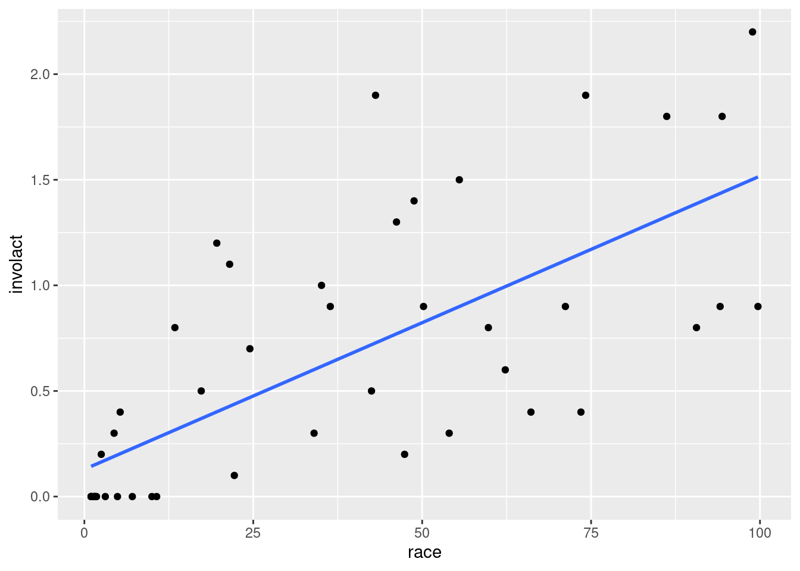
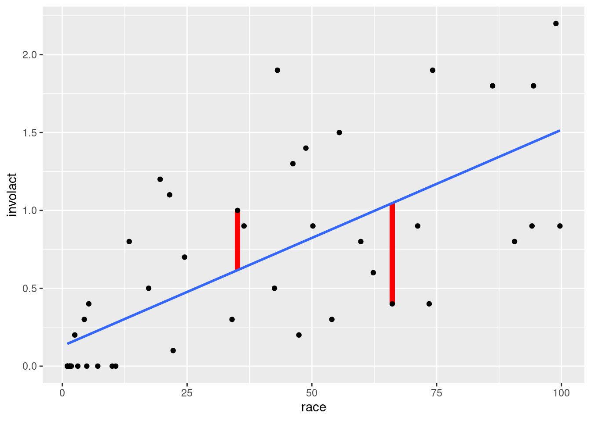
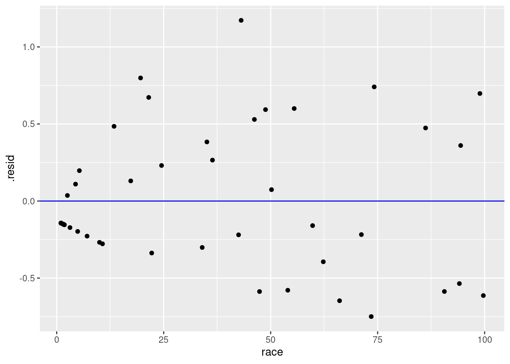
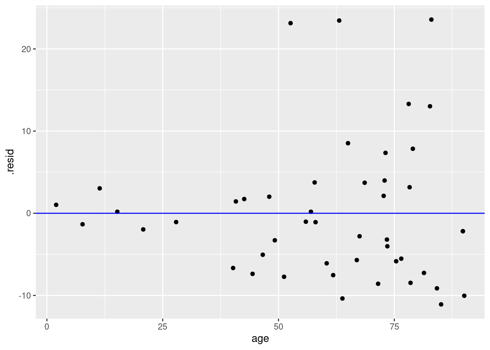
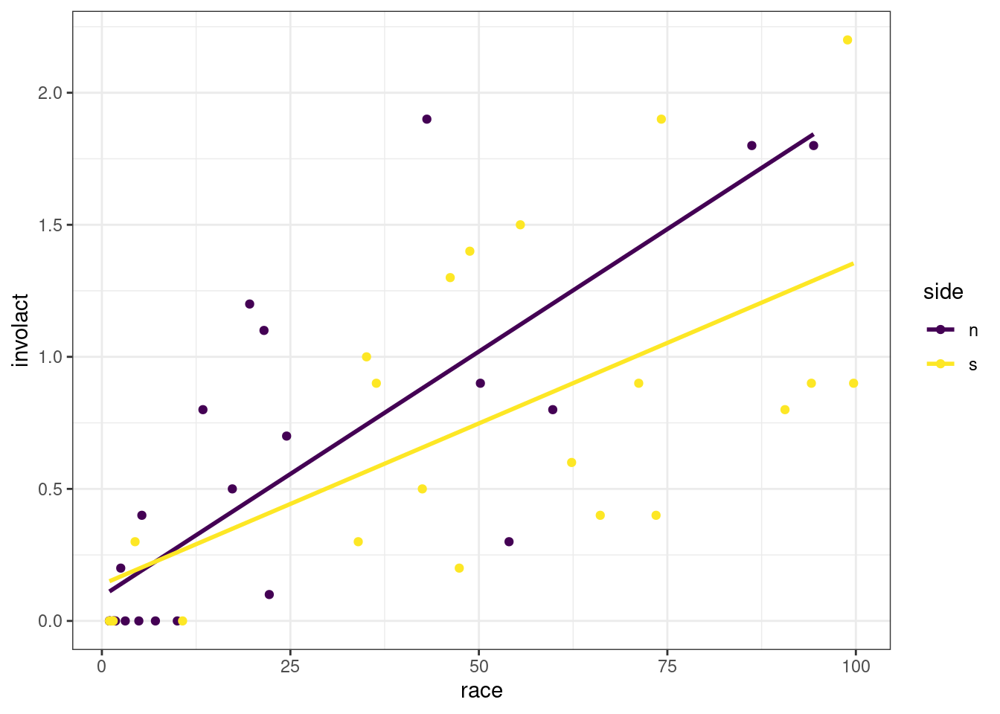

# Regression {#regression}

<!-- Please don't mess with the next few lines! -->
<style>h5{font-size:2em;color:#0000FF}h6{font-size:1.5em;color:#0000FF}div.answer{margin-left:5%;border:1px solid #0000FF;border-left-width:10px;padding:25px} div.summary{background-color:rgba(30,144,255,0.1);border:3px double #0000FF;padding:25px}</style><p style="color:#ffffff">2.0</p>
<!-- Please don't mess with the previous few lines! -->

::: {.summary}

### Functions introduced in this chapter {-}

`geom_smooth`, `lm`, `tidy`, `augment`, `glance`

:::


## Introduction {#regression-intro}

In this chapter we will learn how to run a regression analysis. Regression provides a model for the linear relationship between two numerical variables.

### Install new packages

If you are using RStudio Workbench, you do not need to install any packages. (Any packages you need should already be installed by the server administrators.)

If you are using R and RStudio on your own machine instead of accessing RStudio Workbench through a browser, you'll need to type the following command at the Console:

```
install.packages("broom")
```

### Download the R notebook file {#regression-download}

Check the upper-right corner in RStudio to make sure you're in your `intro_stats` project. Then click on the following link to download this chapter as an R notebook file (`.Rmd`).

<a href = "https://vectorposse.github.io/intro_stats/chapter_downloads/07-regression.Rmd" download>https://vectorposse.github.io/intro_stats/chapter_downloads/07-regression.Rmd</a>

Once the file is downloaded, move it to your project folder in RStudio and open it there.

### Restart R and run all chunks {#regression-restart}

In RStudio, select "Restart R and Run All Chunks" from the "Run" menu.

### Load packages {#regression-load}

We load the `tidyverse` package. The `faraway` package will give access to the Chicago redlining data introduced in the previous chapter and the `palmerpenguins` package gives us the `penguins` data. Finally, the `broom` package will provide tools for cleaning up the output of the regression analysis we perform.


```r
library(tidyverse)
```

```
## ── Attaching core tidyverse packages ──────────────────────── tidyverse 2.0.0 ──
## ✔ dplyr     1.1.2     ✔ readr     2.1.4
## ✔ forcats   1.0.0     ✔ stringr   1.5.0
## ✔ ggplot2   3.4.2     ✔ tibble    3.2.1
## ✔ lubridate 1.9.2     ✔ tidyr     1.3.0
## ✔ purrr     1.0.2     
## ── Conflicts ────────────────────────────────────────── tidyverse_conflicts() ──
## ✖ dplyr::filter() masks stats::filter()
## ✖ dplyr::lag()    masks stats::lag()
## ℹ Use the conflicted package (<http://conflicted.r-lib.org/>) to force all conflicts to become errors
```

```r
library(faraway)
```

```
## Warning: package 'faraway' was built under R version 4.3.1
```

```r
library(palmerpenguins)
```

```
## Warning: package 'palmerpenguins' was built under R version 4.3.1
```

```r
library(broom)
```

```
## Warning: package 'broom' was built under R version 4.3.1
```


## Regression {#regression-regression}

When we have a linear relationship between two numerical variables, we learned in the last chapter that we can compute the correlation coefficient. One serious limitation of the correlation coefficient is that it is only a single number, and therefore, it doesn't provide a whole lot of information about the nature of the linear relationship itself. It only gives clues as to the strength and direction of the association.

It will be helpful to model this linear relationship with an actual straight line. Such a line is called a *regression line*. It is also known as a *best-fit line* or *least-squares line* for reasons that we will get to later in the chapter.

The mathematics involved in figuring out what this line should be is more complicated than we cover in this book. Fortunately, R will do all the complicated calculations for us and we'll focus on understanding what they mean.

Recall the `chredlin` data set from the last chapter investigating the practice of redlining in Chicago in the 1970s. Let's review the scatterplot of `involact`, the number of FAIR policies per 100 housing units, against `race`, the racial composition of each ZIP code as a percentage of minority residents. (Recall that each row of the data represents an entire ZIP code.)


```r
ggplot(chredlin, aes(y = involact, x = race)) +
    geom_point()
```


##### Exercise 1 {-}

Does the Chicago redlining data come from an observational study or an experiment? How do you know?

::: {.answer}

Please write up your answer here.

:::

*****


If certain conditions are met, we can graph a regression line; just add a `geom_smooth` layer to the scatterplot:


```r
ggplot(chredlin, aes(y = involact, x = race)) +
    geom_point() +
    geom_smooth(method = lm, se = FALSE)
```

```
## `geom_smooth()` using formula = 'y ~ x'
```



The `method = lm` argument is telling `ggplot` to use a "linear model". The `se = FALSE` argument tells `ggplot` to draw just the line and nothing else. (What else might it try to draw? You are encouraged to go back to the code above and take out `se = FALSE` to see for yourself. However, we are not yet in a position to be able to explain the gray band that appears. We will return to this mystery in a future chapter.)

Of all possible lines, the blue line comes the closest to each point in the scatterplot. If we wiggled the line a little bit, it might get closer to a few points, but the net effect would be to make it further from other points. This is the mathematically optimal line of best fit.


## Models {#regression-models}

We used the word "model" when referring to the regression line above. What does that word mean in this context?

A model is something that represents something else, often on a smaller scale or in simplified form. A model is often an idealized form of something that may be quite messy or complex in reality. In statistics, a model is a representation of the way data is generated. For example, we may believe that as minority representation increases in a neighborhood, that neighborhood is more likely to be subject to racially discriminatory practices. We may even posit that the relationship is linear; i.e., for every percentage point increase in racial minorities, we expect some kind of proportional increase in racial discrimination, as measured in this case by FAIR policies. We say that this is our hypothesis about the *data-generating process*: we suspect that the data we see results from a sociological process that uses the minority representation of a neighborhood to generate data about FAIR policies.

The assumption of a linear relationship between these two quantities is just that---an assumption. It is not necessarily "true", whatever "true" might mean in this kind of question. It is a convenient device that makes a simplifying assumption in order to allow us to do something meaningful in a statistical analysis. If such a model---despite its simplifying caricature---helps us make meaningful predictions to study something important like racial discrimination, then the model is useful.

The first thing we acknowledge when working with a model is that the model does not generate the data in a rigid, deterministic way. If you look at the scatterplot above, even assuming the blue line represents a "correct" data-generating process, the data points don't fall on the blue line. The blue line gives us only a sense of where the data might be, but there is additional space between the line and the points. These spaces are often referred to as *errors*. In statistics, the word "error" does not mean the same thing as "mistake". Error is just the difference between an idealized model prediction and the real location of data. In the context of linear regression, we will use the term *residual* instead. After the model is done making a prediction, the residuals are "left over" to account for the different between the model and the actual data.

The most important thing to remember about models is that they aren't real. They are idealizations and simplifications. The degree to which we can trust models, then, comes down to certain assumptions we make about the data-generating process. These assumptions cannot be completely verified---after all, we will never know the exact data-generating process. But there are certain *conditions* we can check to know if the assumptions we make are reasonable.

##### Exercise 2 {-}

Do an internet search for the phrase "statistical model" and/or "statistical modeling". Read at least two or three sources. List below one important aspect of statistical modeling you find in your search that wasn't mentioned in the paragraphs above. (Some of the sources you find may be a little technical. You should, for now, skip over the technical explanations. Try to find several sources that address the issue in non-technical ways. The additional information you mention below should be something non-technical that you understand.)

::: {.answer}

Please write up your answer here.

:::

*****


## Checking conditions {#regression-conditions}

We need to be careful here. Although we graphed the blue regression line above, we have not checked any conditions. Therefore, it is inappropriate to fit a regression line at this point. Once the line is seen, it cannot easily be "unseen", and it's crucial that you don't trick your eyes into believing there is a linear relationship before checking the conditions that justify that belief. 

The regression line we saw above makes no sense unless we know that regression is appropriate. The conditions for running a regression analysis include all the conditions you checked for a correlation analysis in the last chapter:

1. The two variables must be numerical.
2. There is a somewhat linear relationship between the variables, as shown in a scatterplot.
3. There are no serious outliers.


##### Exercise 3 {-}

Check these three conditions for the regression between `involact` and `race` (using the scatterplot above for conditions (2) and (3).)

::: {.answer}

1.
2.
3.

:::

*****


However, there is an additional condition to check to ensure that our regression model is appropriate. It concerns the residuals, but as we haven't computed anything yet, we have nothing to analyze. We'll return to this condition later.


## Calculating the regression line {#regression-calculating}

What is the equation of the regression line? In your algebra class you learned that a line takes the form $y = mx + b$ where $m$ is the slope and $b$ is the y-intercept. Statisticians write the equation in a slightly different form:

$$
\hat{y} = b_{0} + b_{1} x
$$

The intercept is $b_{0}$ and the slope is $b_{1}$. We use $\hat{y}$ (pronounced "y hat") instead of $y$ because when we plug in values of $x$, we do not get back the exact values of $y$ from the data. The line, after all, does not actually pass through most (if any) actual data points. Instead, this equation gives us "predicted" values of $y$ that lie on the regression line. These predicted $y$ values are called $\hat{y}$.

To run a regression analysis and calculate the values of the intercept and slope, we use the `lm` command in R. (Again, `lm` stands for "linear model".) This command requires us to specify a "formula" that tells R the relationship we want to model. It uses special syntax in a very specific order:

- The response variable,
- a "tilde" ~ (this key is usually in the upper-left corner of your keyboard, above the backtick),
- the predictor variable.

After a comma, we then specify the data set in which those variables live using `data =`. Here's the whole command:


```r
lm(involact ~ race, data = chredlin)
```

```
## 
## Call:
## lm(formula = involact ~ race, data = chredlin)
## 
## Coefficients:
## (Intercept)         race  
##     0.12922      0.01388
```

**The response variable always goes before the tilde and the predictor variable always goes after.**

Let's store that result for future use. The convention we'll use in this book is to name things using the variables involved. For example,


```r
involact_race_lm <- lm(involact ~ race, data = chredlin)
involact_race_lm
```

```
## 
## Call:
## lm(formula = involact ~ race, data = chredlin)
## 
## Coefficients:
## (Intercept)         race  
##     0.12922      0.01388
```

The variable `involact_race_lm` now contains all the information we need about the linear regression model.


## Interpreting the coefficients {#regression-interpreting}

Look at the output of the `lm` command above.

The intercept is 0.12922 and the slope is 0.01388. The number 0.12922 is labeled with `(Intercept)`, so that's pretty obvious. But how do we know the number 0.01388 corresponds to the slope? Process of elimination, I suppose. But there's another good reason too. The equation of the regression line can be written

$$
\hat{y} = 0.12922 + 0.01388 x
$$

When we report the equation of the regression line, we typically use words instead of $\hat{y}$ and $x$ to make the equation more interpretable in the context of the problem. For example, for this data, we would write the equation as

$$
\widehat{involact} = 0.12922 + 0.01388 race
$$

The slope is the *coefficient* of `race`, or the number attached to `race`. (The intercept is not attached to anything; it's just a constant term out front there.)

The slope $b_{1}$ is always interpretable. This model predicts that one unit of increase in the x-direction corresponds to a change of 0.01388 units in the y-direction. Let's phrase it this way:

> The model predicts that an increase of one percentage point in the composition of racial minorities corresponds to an increase of 0.01388 new FAIR policies per 100 housing units.

The intercept $b_{0}$ is a different story. There is always a literal interpretation:

> The model predicts that a ZIP code with 0% racial minorites will generate 0.12922 new FAIR policies.

In some cases (rarely), that interpretation might make sense. In most cases, though, it is physically impossible for the predictor variable to take a value of 0, or the value 0 is way outside the range of the data. Whenever we use a model to make a prediction outside of reasonable values, we call that *extrapolation*.

For the Chicago data, we likely don't have a case of extrapolation. While it is not literally true that any ZIP code has 0% racial minorities, we can see in the scatterplot that there are values very close to zero.

##### Exercise 4 {-}

Use the `arrange` command from `dplyr` to sort the `chredlin` data frame by race (using the default ascending order). What is the value of `race` for the three ZIP codes with the smallest percentage of minority residents?

::: {.answer}


```r
# Add code here to sort by race
```

Please write up your answer here.

:::

*****

Again, even though there are no ZIP codes with 0% racial minorities, there are a bunch that are close to zero, so the literal interpretation of the intercept is also likely a sensible one in this case.

##### Exercise 5 {-}

Let's think through something else the intercept might be telling us in this case. The presumption is that FAIR policies are obtained mostly by folks who can't get insurance policies in other ways. Some of that is driven by racial discrimination, but maybe not all of it. What does the intercept have to say about the number of FAIR policies that are obtained *not* due to denial of coverage from racial discrimination?

::: {.answer}

Please write up your answer here.

:::


## Rescaling to make interpretations more meaningful {#regression-rescaling}

Let's revisit the interpretation of the slope:

> The model predicts that an increase of one percentage point in the composition of racial minorities corresponds to an increase of 0.01388 new FAIR policies per 100 housing units.

This is a perfectly correct statement, but one percentage point change is not very much. It's hard to think about comparing two neighborhoods that differ by only one percent. This scale also makes the predicted change in the response variable hard to interpret. How many policies is 0.01388 per 100 housing units?

One way to make these kinds of statements more interpretable is to change the scale. What if we increase 10 percentage points instead of only 1 percentage point? In other words, what if we move 10 times as far along the x-axis. The response variable will also have to move 10 times as far. This is the new statement:

> The model predicts that an increase of 10 percentage points in the composition of racial minorities corresponds to an increase of 0.1388 new FAIR policies per 100 housing units.

In this case, the decimal 0.1388 is maybe still not completely clear, but at least an increase of 10 percentage points is a meaningful difference between neighborhoods.

##### Exercise 6 {-}

Since the last number is a *per capita* type measure, we can also rescale it. If the model predicts an increase in 0.1388 new FAIR policies per 100 households (corresponding to 10 percentage points increase in racial minorities), how many FAIR policies would that be in 1000 households?

::: {.answer}

Please write up your answer here.

:::


## The `tidy` command {#regression-tidy}

Recall the output of the `lm` command:


```r
involact_race_lm
```

```
## 
## Call:
## lm(formula = involact ~ race, data = chredlin)
## 
## Coefficients:
## (Intercept)         race  
##     0.12922      0.01388
```

(We did not have to run `lm` again. We had this output stored in the variable `involact_race_lm`.)

That summary is fine, but what if we needed to reference the slope and intercept using inline code? Or what if we wanted to grab those numbers and use them in further calculations?

The problem is that the results of `lm` just print the output in an unstructured way. If we want structured input, we can use the `tidy` command from the `broom` package. This will take the results of `lm` and organize the output into a tibble.


```r
tidy(involact_race_lm)
```

<div data-pagedtable="false">
  <script data-pagedtable-source type="application/json">
{"columns":[{"label":["term"],"name":[1],"type":["chr"],"align":["left"]},{"label":["estimate"],"name":[2],"type":["dbl"],"align":["right"]},{"label":["std.error"],"name":[3],"type":["dbl"],"align":["right"]},{"label":["statistic"],"name":[4],"type":["dbl"],"align":["right"]},{"label":["p.value"],"name":[5],"type":["dbl"],"align":["right"]}],"data":[{"1":"(Intercept)","2":"0.12921803","3":"0.09661059","4":"1.337514","5":"0.18777606076934"},{"1":"race","2":"0.01388235","3":"0.00203073","4":"6.836139","5":"0.00000001783815"}],"options":{"columns":{"min":{},"max":[10]},"rows":{"min":[10],"max":[10]},"pages":{}}}
  </script>
</div>

Let's store that tibble so we can refer to it in the future.


```r
involact_race_tidy <- tidy(involact_race_lm)
involact_race_tidy
```

<div data-pagedtable="false">
  <script data-pagedtable-source type="application/json">
{"columns":[{"label":["term"],"name":[1],"type":["chr"],"align":["left"]},{"label":["estimate"],"name":[2],"type":["dbl"],"align":["right"]},{"label":["std.error"],"name":[3],"type":["dbl"],"align":["right"]},{"label":["statistic"],"name":[4],"type":["dbl"],"align":["right"]},{"label":["p.value"],"name":[5],"type":["dbl"],"align":["right"]}],"data":[{"1":"(Intercept)","2":"0.12921803","3":"0.09661059","4":"1.337514","5":"0.18777606076934"},{"1":"race","2":"0.01388235","3":"0.00203073","4":"6.836139","5":"0.00000001783815"}],"options":{"columns":{"min":{},"max":[10]},"rows":{"min":[10],"max":[10]},"pages":{}}}
  </script>
</div>

The intercept is stored in the `estimate` column, in the first row. The slope is stored in the same column, but in the second row. (There is a lot more information here to the right of the `estimate` column, but we will not know what these numbers mean until later in the course.)

We can grab the `estimate` column with the dollar sign as we've seen before:


```r
involact_race_tidy$estimate
```

```
## [1] 0.12921803 0.01388235
```

This is a "vector" of two values, the intercept and the slope, respectively.

What if we want only one value at a time? We can grab individual elements of a vector using square brackets as follows:


```r
involact_race_tidy$estimate[1]
```

```
## [1] 0.129218
```


```r
involact_race_tidy$estimate[2]
```

```
## [1] 0.01388235
```

Here is the interpretation of the slope again, but this time, we'll use inline code:

> The model predicts that an increase of 1 percentage points in the composition of racial minorities corresponds to an increase of 0.0138824 new FAIR policies per 100 housing units.

Click somewhere inside the backticks on the line above and hit Ctrl-Enter or Cmd-Enter (PC or Mac respectively). You should see the number 0.01388235 pop up. If you Preview the HTML version of the document, you will also see the number there (not the code).

What if we want to apply re-scaling to make this number more interpretable? The stuff inside the inline code chunk is just R code, so we can do any kind of calculation with it we want.

> The model predicts that an increase of 10 percentage points in the composition of racial minorities corresponds to an increase of 0.1388235 new FAIR policies per 100 housing units.

Now the number will be 0.1388235, ten times as large.

##### Exercise 7 {-}

Copy and paste the interpretation of the intercept from earlier, but replace the number 0.12922 with an inline code chunk that grabs that number from the `estimate` column of the `involact_race_tidy` tibble. (Remember that the intercept is the *first* element of that vector, not the second element like the slope.)

::: {.answer}

Please write up your answer here.

:::


## Residuals {#regression-residuals}

Earlier, we promised to revisit the topic of residuals. Residuals are measured as the vertical distances from each data point to the regression line. We can see that visually below. (Don't worry about the complexity of the `ggplot` code used to create this picture. You will not need to create a plot like this on your own, so just focus on the graph that is created below.)


```r
ggplot(chredlin, aes(y = involact, x = race)) +
    geom_segment(x = 35.1, xend  = 35.1,
                 y = 0.6164886, yend = 0.6164886 + 0.38351139,
                 color = "red", size = 2) +
    geom_segment(x = 66.1, xend = 66.1,
                 y = 1.0468415, yend = 1.0468415 - 0.64684154,
                 color = "red", size = 2) +
    geom_point() +
    geom_smooth(method = lm, se = FALSE)
```

```
## Warning: Using `size` aesthetic for lines was deprecated in ggplot2 3.4.0.
## ℹ Please use `linewidth` instead.
## This warning is displayed once every 8 hours.
## Call `lifecycle::last_lifecycle_warnings()` to see where this warning was
## generated.
```

```
## `geom_smooth()` using formula = 'y ~ x'
```



The graph above shows the regression line and two of the residuals as red line segments. (There is a residual for all 47 ZIP codes; only two are shown in this graph.) The one on the left corresponds to ZIP code with 35% racial minority. The regression line predicts that, if the model were true, such a ZIP code would have a value of `involact` of about 0.6. But the actual data for that ZIP code has an `involact` value of 1. The residual is the difference, about 0.4. In other words, the true data point is 0.4 units higher than the model prediction. This represents a *positive* residual; the actual data is 0.4 units *above* the line. Data points that lie below the regression line have *negative* residuals.

##### Exercise 8 {-}

Look at the residual on the right. This corresponds to a ZIP code with about 66% racial minorities. First, estimate the value of `involact` that the model predicts for this ZIP code. (This is the y-value of the point on the regression line.) Next, report the actual `involact` value for this ZIP code. Finally, subtract these two numbers to get an approximate value for the residual. Should this residual be a positive number or a negative number?

You can just estimate with your eyeballs for now. You don't need to be super precise.

::: {.answer}

Please write up your answer here.

:::

*****


More formally, let's call the residual $e$. This is standard notation, as "e" stands for "error". Again, though, it's not an error in the sense of a mistake. It's an error in the sense that the model is not perfectly accurate, so it doesn't predict the data points exactly. The degree to which the prediction misses is the "error" or "residual". It is given by the following formula:

$$
e = y - \hat{y}
$$

##### Exercise 9 {-}

There are two symbols on the right-hand side of the equation above, $y$ and $\hat{y}$. Which one is the actual data value and which one is the predicted value (the one on the line)?

::: {.answer}

Please write up your answer here.

:::

*****

The residuals are used to determine the regression line. The correct regression line will be the one that results in the smallest residuals overall. How do we measure the overall set of residuals? We can't just calculate the average residual. Because the regression line should go through the middle of the data, the positive residuals will cancel out the negative residuals and the mean residual will just be zero. That's not very useful.

Instead, what we do is *square* the residuals. That makes all of them positive. Then we add together all the squared residuals and that sum is the thing we try to minimize. Well, we don't do that manually because it's hard, so we let the computer do that for us. Because the regression line minimizes the sum of the squared residuals, the regression line is often called the *least-squares* line.

Recall earlier when we mentioned that there was one additional condition to check in order for linear regression to make sense. This condition is that **there should not be any kind of pattern in the residuals**.

We know that some of the points are going to lie above the line (positive residuals) and some of the points will lie below the line (negative residuals). What we need is for the spread of the residuals to be pretty balanced across the length of the regression line and for the residuals not to form any kind of curved pattern.

To check this condition, we'll need to calculate the residuals first. To do so, we introduce a new function from the `broom` package. Whereas `tidy` serves up information about the intercept and the slope of the regression line, `augment` gives us extra information for each data point.


```r
involact_race_aug <- augment(involact_race_lm)
involact_race_aug
```

<div data-pagedtable="false">
  <script data-pagedtable-source type="application/json">
{"columns":[{"label":[".rownames"],"name":[1],"type":["chr"],"align":["left"]},{"label":["involact"],"name":[2],"type":["dbl"],"align":["right"]},{"label":["race"],"name":[3],"type":["dbl"],"align":["right"]},{"label":[".fitted"],"name":[4],"type":["dbl"],"align":["right"]},{"label":[".resid"],"name":[5],"type":["dbl"],"align":["right"]},{"label":[".hat"],"name":[6],"type":["dbl"],"align":["right"]},{"label":[".sigma"],"name":[7],"type":["dbl"],"align":["right"]},{"label":[".cooksd"],"name":[8],"type":["dbl"],"align":["right"]},{"label":[".std.resid"],"name":[9],"type":["dbl"],"align":["right"]}],"data":[{"1":"60626","2":"0.0","3":"10.0","4":"0.2680416","5":"-0.26804156","6":"0.03405567","7":"0.4520376","8":"0.0065086692","9":"-0.60763450"},{"1":"60640","2":"0.1","3":"22.2","4":"0.4374063","5":"-0.33740626","6":"0.02462275","7":"0.4509720","8":"0.0073130785","9":"-0.76117263"},{"1":"60613","2":"1.2","3":"19.6","4":"0.4013121","5":"0.79868786","6":"0.02612209","7":"0.4371976","8":"0.0436069516","9":"1.80318864"},{"1":"60657","2":"0.5","3":"17.3","4":"0.3693827","5":"0.13061727","6":"0.02767914","7":"0.4534641","8":"0.0012397588","9":"0.29512917"},{"1":"60614","2":"0.7","3":"24.5","4":"0.4693357","5":"0.23066433","6":"0.02352711","7":"0.4525374","8":"0.0032584559","9":"0.52007584"},{"1":"60610","2":"0.3","3":"54.0","4":"0.8788651","5":"-0.57886508","6":"0.02867818","7":"0.4451831","8":"0.0252803288","9":"-1.30861567"},{"1":"60611","2":"0.0","3":"4.9","4":"0.1972416","5":"-0.19724156","6":"0.03980509","7":"0.4528881","8":"0.0041688796","9":"-0.44847172"},{"1":"60625","2":"0.0","3":"7.1","4":"0.2277827","5":"-0.22778273","6":"0.03719434","7":"0.4525524","8":"0.0051670651","9":"-0.51721109"},{"1":"60618","2":"0.4","3":"5.3","4":"0.2027945","5":"0.19720550","6":"0.03931567","7":"0.4528889","8":"0.0041119233","9":"0.44827551"},{"1":"60647","2":"1.1","3":"21.5","4":"0.4276886","5":"0.67231139","6":"0.02499919","7":"0.4421451","8":"0.0295025539","9":"1.51699559"},{"1":"60622","2":"1.9","3":"43.1","4":"0.7275474","5":"1.17245257","6":"0.02262464","7":"0.4172089","8":"0.0808075725","9":"2.64229271"},{"1":"60631","2":"0.0","3":"1.1","4":"0.1444886","5":"-0.14448862","6":"0.04478130","7":"0.4533561","8":"0.0025430857","9":"-0.32938102"},{"1":"60646","2":"0.0","3":"1.0","4":"0.1431004","5":"-0.14310038","6":"0.04492023","7":"0.4533665","8":"0.0025029201","9":"-0.32624008"},{"1":"60656","2":"0.0","3":"1.7","4":"0.1528180","5":"-0.15281803","6":"0.04395628","7":"0.4532916","8":"0.0027875153","9":"-0.34821867"},{"1":"60630","2":"0.0","3":"1.6","4":"0.1514298","5":"-0.15142979","6":"0.04409276","7":"0.4533026","8":"0.0027463829","9":"-0.34508001"},{"1":"60634","2":"0.0","3":"1.5","4":"0.1500416","5":"-0.15004156","6":"0.04422965","7":"0.4533135","8":"0.0027054043","9":"-0.34194096"},{"1":"60641","2":"0.0","3":"1.8","4":"0.1542063","5":"-0.15420627","6":"0.04382021","7":"0.4532805","8":"0.0028287985","9":"-0.35135697"},{"1":"60635","2":"0.0","3":"1.0","4":"0.1431004","5":"-0.14310038","6":"0.04492023","7":"0.4533665","8":"0.0025029201","9":"-0.32624008"},{"1":"60639","2":"0.2","3":"2.5","4":"0.1639239","5":"0.03607609","6":"0.04287918","7":"0.4538695","8":"0.0001512009","9":"0.08215848"},{"1":"60651","2":"0.8","3":"13.4","4":"0.3152416","5":"0.48475844","6":"0.03081433","7":"0.4477923","8":"0.0191334054","9":"1.09707983"},{"1":"60644","2":"0.8","3":"59.8","4":"0.9593827","5":"-0.15938272","6":"0.03388215","7":"0.4532448","8":"0.0022887370","9":"-0.36127884"},{"1":"60624","2":"1.8","3":"94.4","4":"1.4397121","5":"0.36028787","6":"0.09354154","7":"0.4503041","8":"0.0366784255","9":"0.84312512"},{"1":"60612","2":"1.8","3":"86.2","4":"1.3258768","5":"0.47412317","6":"0.07497107","7":"0.4477783","8":"0.0488841540","9":"1.09832244"},{"1":"60607","2":"0.9","3":"50.2","4":"0.8261121","5":"0.07388786","6":"0.02601547","7":"0.4537632","8":"0.0003716006","9":"0.16680667"},{"1":"60623","2":"1.9","3":"74.2","4":"1.1592886","5":"0.74071140","6":"0.05275691","7":"0.4391635","8":"0.0800676782","9":"1.69564387"},{"1":"60608","2":"1.5","3":"55.5","4":"0.8996886","5":"0.60031139","6":"0.02989200","7":"0.4445062","8":"0.0284099605","9":"1.35794719"},{"1":"60616","2":"0.6","3":"62.3","4":"0.9940886","5":"-0.39408860","6":"0.03655001","7":"0.4498498","8":"0.0151781749","9":"-0.89453148"},{"1":"60632","2":"0.3","3":"4.4","4":"0.1903004","5":"0.10969962","6":"0.04042608","7":"0.4535895","8":"0.0013113470","9":"0.24950671"},{"1":"60609","2":"1.3","3":"46.2","4":"0.7705827","5":"0.52941727","6":"0.02385130","7":"0.4466573","8":"0.0174132162","9":"1.19386840"},{"1":"60653","2":"0.9","3":"99.7","4":"1.5132886","5":"-0.61328860","6":"0.10700910","7":"0.4432334","8":"0.1252734721","9":"-1.44596477"},{"1":"60615","2":"0.4","3":"73.5","4":"1.1495710","5":"-0.74957096","6":"0.05164307","7":"0.4388207","8":"0.0800749424","9":"-1.71491729"},{"1":"60638","2":"0.0","3":"10.7","4":"0.2777592","5":"-0.27775920","6":"0.03334965","7":"0.4519010","8":"0.0068342682","9":"-0.62943384"},{"1":"60629","2":"0.0","3":"1.5","4":"0.1500416","5":"-0.15004156","6":"0.04422965","7":"0.4533135","8":"0.0027054043","9":"-0.34194096"},{"1":"60636","2":"1.4","3":"48.8","4":"0.8066768","5":"0.59332316","6":"0.02518349","7":"0.4447707","8":"0.0231555723","9":"1.33889402"},{"1":"60621","2":"2.2","3":"98.9","4":"1.5021827","5":"0.69781729","6":"0.10490257","7":"0.4400732","8":"0.1582455924","9":"1.64332290"},{"1":"60637","2":"0.8","3":"90.6","4":"1.3869592","5":"-0.58695919","6":"0.08459344","7":"0.4443814","8":"0.0863231206","9":"-1.36683859"},{"1":"60652","2":"0.0","3":"1.4","4":"0.1486533","5":"-0.14865332","6":"0.04436694","7":"0.4533243","8":"0.0026645822","9":"-0.33880154"},{"1":"60620","2":"0.9","3":"71.2","4":"1.1176415","5":"-0.21764154","6":"0.04812457","7":"0.4526560","8":"0.0062444310","9":"-0.49701338"},{"1":"60619","2":"0.9","3":"94.1","4":"1.4355474","5":"-0.53554742","6":"0.09281362","7":"0.4459183","8":"0.0802818194","9":"-1.25275461"},{"1":"60649","2":"0.4","3":"66.1","4":"1.0468415","5":"-0.64684154","6":"0.04109523","7":"0.4428450","8":"0.0464129236","9":"-1.47172445"},{"1":"60617","2":"0.9","3":"36.4","4":"0.6345357","5":"0.26546433","6":"0.02131758","7":"0.4520973","8":"0.0038928646","9":"0.59786292"},{"1":"60655","2":"0.0","3":"1.0","4":"0.1431004","5":"-0.14310038","6":"0.04492023","7":"0.4533665","8":"0.0025029201","9":"-0.32624008"},{"1":"60643","2":"0.5","3":"42.5","4":"0.7192180","5":"-0.21921802","6":"0.02243266","7":"0.4526712","8":"0.0027999007","9":"-0.49399124"},{"1":"60628","2":"1.0","3":"35.1","4":"0.6164886","5":"0.38351139","6":"0.02127687","7":"0.4501256","8":"0.0081086240","9":"0.86370350"},{"1":"60627","2":"0.2","3":"47.4","4":"0.7872415","5":"-0.58724155","6":"0.02443177","7":"0.4449658","8":"0.0219723154","9":"-1.32465959"},{"1":"60633","2":"0.3","3":"34.0","4":"0.6012180","5":"-0.30121802","6":"0.02129646","7":"0.4515766","8":"0.0050069092","9":"-0.67837793"},{"1":"60645","2":"0.0","3":"3.1","4":"0.1722533","5":"-0.17225332","6":"0.04208855","7":"0.4531274","8":"0.0033779335","9":"-0.39212205"}],"options":{"columns":{"min":{},"max":[10]},"rows":{"min":[10],"max":[10]},"pages":{}}}
  </script>
</div>

The first three columns consist of the row names (the ZIP codes) followed by the actual data values we started with for `involact` and `race`. But now we've "augmented" the original data with some new stuff too. (We won't learn about anything past the fifth column in this course, though.)

The fourth column---called `.fitted`---is $\hat{y}$, or the point on the line that corresponds to the given $x$ value. Let's check and make sure this is working as advertised.

The regression equation from above is

$$
\widehat{involact} = 0.12922 + 0.01388 race
$$

Take, for example, the first row in the tibble above, the one corresponding to ZIP code 60626. The value of `race` is 10.0. Plug that value into the equation above:

$$
\widehat{involact} = 0.12922 + 0.01388(10.0) = 0.268
$$

The model predicts that a ZIP code with 10% racial minorities will have about 0.268 new FAIR policies per 100 housing units. The corresponding number in the `.fitted` column is 0.2680416, so that's correct.

Now skip over to the fifth column of the `augment` output, the one that says `.resid`. If this is the residual $e$, then it should be $y - \hat{y}$. Since $y$ is the actual value of `involact` and $\hat{y}$ is the value predicted by the model, we should get for the first row of output

$$
e = y - \hat{y} = 0.0 - 0.268 = -0.268
$$

Yup, it works!

To check for patterns in the residuals, we'll create a *residual plot*. A residual plot graphs the residuals above each value along the x-axis. (In the command below, we also add a blue horizontal reference line so that it is clear which points have positive or negative residuals.)


```r
ggplot(involact_race_aug, aes(y = .resid, x = race)) +
    geom_point() +
    geom_hline(yintercept = 0, color = "blue")
```



Pay close attention to the `ggplot` code. Notice that the tibble in the first slot is *not* `chredlin` as it was before. The residuals we need to plot are not stored in the raw `chredlin` data. We had to calculate the residuals using the `augment` command, and those residuals are then stored in a different place that we named `involact_race_aug`. In the latter tibble, the residuals themselves are stored in a variable called `.resid`. (Don't forget the dot in `.resid`.)

We are looking for systematic patterns in the residuals. A good residual plot should look like the most boring plot you've ever seen.

For the most part, the residual plot above looks pretty good. The one exception is the clustering near the left edge of the graph.

##### Exercise 10 {-}

Refer back and forth between the original scatterplot created earlier (with the regression line) and the residual plot above. Can you explain why there is a line of data points with negative residuals along the left edge of the residual plot?

::: {.answer}

Please write up your answer here.

:::

*****

Residual patterns that are problematic often involve curved data (where the dots follow a curve around the horizontal reference line instead of spreading evenly around it) and *heteroscedasticity*, which is a fanning out pattern from left to right.

Other than the weird cluster of points at the left, the rest of the residual plot looks pretty good. Ignoring those ZIP codes with 0 FAIR policies, the rest of the residuals stretch, on average, about the same height above and below the line across the whole width of the plot. There is only one slightly large residual at about the 40% mark, but it's not extreme, and it doesn't look like a severe outlier in the original scatterplot.

What does a bad residual plot look like? The code below will run an ill-advised regression analysis on `fire`, the number of fires (per 100 housing units), against `age`, the percent of housing units built before 1939. The residual plot appears below.


```r
fire_age_lm <- lm(fire ~ age, data = chredlin)
fire_age_aug <- augment(fire_age_lm)
ggplot(fire_age_aug, aes(y = .resid, x = age)) +
    geom_point() +
    geom_hline(yintercept = 0, color = "blue")
```



##### Exercise 11 {-}

Using the vocabulary established above, explain why the residual plot above is bad.

::: {.answer}

Please write up your answer here.

:::

*****

Of course, we should never even get as far as running a regression analysis and making a residual plot if we perform exploratory data analysis as we're supposed to.

##### Exercise 12(a) {-}

If you were truly interested in investigating an association between the fire risk and the age of buildings in a ZIP code, the first thing you would do is create a scatterplot. Go ahead and do that below. Use `fire` as the response variable and `age` as the predictor.

::: {.answer}


```r
# Add code here to create a scatterplot of fire against age
```

:::

##### Exercise 12(b) {-}

From the scatterplot above, explain why you wouldn't even get as far as running a regression analysis. (Think of the conditions.) 

::: {.answer}

Please write up your answer here.

:::

*****

To review, the conditions for a regression analysis are as follows (including the newest fourth condition):

1. The two variables must be numerical.
2. There is a somewhat linear relationship between the variables, as shown in a scatterplot.
3. There are no serious outliers.
4. **There is no pattern in the residuals.**


## $R^2$ {#regression-r2}

We've seen that the correlation coefficient r is of limited utility. In addition to being only a single statistic to summarize a linear association, the number doesn't have any kind of intrinsic meaning. It can only be judged by how close it is to 0 or 1 (or -1) in conjunction with a scatterplot to give you a sense of the strength of the correlation. **In particular, some people try to interpret r as some kind of percentage, but it's not.**

On the other hand, when we square the correlation coefficient, we *do* get an interpretable number. For some reason, instead of writing $r^2$, statisticians write $R^2$, with a capital R. (I can't find the historical reason why this is so.) In any event, $R^2$ can be interpreted as a percentage! It represents the percent of variation in the y variable that can be explained by variation in the x variable.

Here we introduce the last of the `broom` functions: `glance`. Whereas `tidy` reports the intercept and slope, and `augment` reports values associated to each data point separately, the `glance` function gathers up summaries for the entire model. (Do not confuse `glance` with `glimpse`. The latter is a nicer version of `str` that just summarizes the variables in a tibble.)


```r
involact_race_glance <- glance(involact_race_lm)
involact_race_glance
```

<div data-pagedtable="false">
  <script data-pagedtable-source type="application/json">
{"columns":[{"label":["r.squared"],"name":[1],"type":["dbl"],"align":["right"]},{"label":["adj.r.squared"],"name":[2],"type":["dbl"],"align":["right"]},{"label":["sigma"],"name":[3],"type":["dbl"],"align":["right"]},{"label":["statistic"],"name":[4],"type":["dbl"],"align":["right"]},{"label":["p.value"],"name":[5],"type":["dbl"],"align":["right"]},{"label":["df"],"name":[6],"type":["dbl"],"align":["right"]},{"label":["logLik"],"name":[7],"type":["dbl"],"align":["right"]},{"label":["AIC"],"name":[8],"type":["dbl"],"align":["right"]},{"label":["BIC"],"name":[9],"type":["dbl"],"align":["right"]},{"label":["deviance"],"name":[10],"type":["dbl"],"align":["right"]},{"label":["df.residual"],"name":[11],"type":["int"],"align":["right"]},{"label":["nobs"],"name":[12],"type":["int"],"align":["right"]}],"data":[{"1":"0.5094448","2":"0.4985436","3":"0.4488318","4":"46.7328","5":"0.00000001783815","6":"1","7":"-28.01618","8":"62.03237","9":"67.58281","10":"9.065251","11":"45","12":"47"}],"options":{"columns":{"min":{},"max":[10]},"rows":{"min":[10],"max":[10]},"pages":{}}}
  </script>
</div>

A more advanced statistics course might discuss the other model summaries present in the `glance` output. The $R^{2}$ value is stored in the `r.squared` (inexplicably, now written with a lowercase r). Its value is 0.51. We will word it this way:

> 51% of the variability in FAIR policies can be accounted for by variability in racial composition.

Another way to think about this is to imagine all the factors that might go into the number of FAIR policies obtained in a ZIP code. That number varies across ZIP codes, with some ZIP codes having essentially 0 FAIR policies per 100 housing units, and others having quite a bit more, up to 2 or more per 100 housing units. What accounts for this discrepancy among ZIP codes? Is it the varying racial composition of those neighborhoods? To some degree, yes. We have seen that more racially diverse neighborhoods, on average, require more FAIR policies. But is race the only factor? Probably not. Income, for example, might play a role. People in low income neighborhoods may not be able to acquire traditional insurance due to its cost or their poor credit, etc. That also accounts for some of the variability among ZIP codes. Are there likely even more factors? Most assuredly. In fact, if 51% of the variability in FAIR policies can be accounted for by variability in racial composition. then 49% must be accounted for by other variables. These other variables may or may not be collected in our data, and we will never be able to determine all the factors that go into varying FAIR policy numbers.

$R^2$ is a measure of the fit of the model. High values of $R^2$ mean that the line predicts the data values closely, whereas lower values of $R^2$ mean that there is still a lot of variability left in the residuals (again, due to other factors that are not measured in the model).

##### Exercise 13 {-}

Calculate the correlation coefficient r between `involact` and `race` using the `cor` command. (You might have to look back at the last chapter to remember the syntax.) Store that value as r.

In a separate code chunk, square that value using the command `r^2`. Verify that the square of the correlation coefficient is the same as the $R^2$ value reported in the `glance` output above.

::: {.answer}


```r
# Add code here to calculate the correlation coefficient
```


```r
# Add code here to square the correlation coefficient
```

:::


## Multiple predictors {#regression-multiple}

The discussion of $R^2$ above highlights the fact that a single predictor will rarely account for all or even most of the variability in a response variable. Is there a way to take other predictors into account?

The answer is yes, and the statistical technique involved is called multiple regression. Multiple regression is a deep subject, worthy of entire courses. Suffice it to say here that more advanced stats courses go into the ways in which multiple predictors can be included in a regression.

One easy thing we can do is incorporate a categorical variable into a graph and see if that categorical variable might play a role in the regression analysis. For example, there is a variance called `side` in `chredlin` that indicates whether the ZIP code is on the north side (n) or south side(s) of Chicago. As described in an earlier chapter, we can use color to distinguish between the ZIP codes.


```r
ggplot(chredlin, aes(y = involact, x = race, color = side)) +
    geom_point()
```


##### Exercise 14 {-}

Do neighborhoods with higher percent racial minorities tend to be on the north or south side of Chicago?


::: {.answer}

Please write up your answer here.

:::

*****


Does this affect the regression? We haven't checked the conditions carefully for this new question, so we will exercise caution in coming to any definitive conclusions. But visually, there does appear to be a difference in the models generated for ZIP codes on the north versus south sides:


```r
ggplot(chredlin, aes(y = involact, x = race, color = side)) +
    geom_point() +
    geom_smooth(method = lm, se = FALSE)
```

```
## `geom_smooth()` using formula = 'y ~ x'
```



##### Exercise 15 {-}

Although the slopes appear to be different, this is quite misleading. Focus on just the red dots. Which regression condition appears to be violated if we only consider the north side regression? How does that violation appear to affect the slope of the regression line?

::: {.answer}

Please write up your answer here.

:::


## Your turn {#regression-your-turn}

Let's revisit the `penguins` data. Imagine that it was much easier to measure body mass than it was to measure flipper length. (I'm not a penguin expert, so I don't know if that's true, but it seems plausible. Weighing a penguin can be done without human contact, for example.) Can we accurately predict flipper length from body mass? (This means that `flipper_length_mm` should be the response variable on the y-axis and `body_mass_g` should be the predictor variable on the x-axis.)

##### Exercise 16(a) {-}

Create a scatterplot of the data. Do *not* include a regression line yet. (In other words, there should be no `geom_smooth` in this plot.)

::: {.answer}


```r
# Add code here to create a scatterplot of the data
```

:::

##### Exercise 16(b) {-}

Use the scatterplot above to check the first three conditions of regression.

::: {.answer}

1.
2.
3.

:::

##### Exercise 16(c) {-}

As we're reasonably satisfied that the first three conditions are met and regression is worth pursuing, run the `lm` command to perform the regression analysis. Assign the output to the name `fl_bm_lm`. Be sure to type the variable name `fl_bm_lm` on its own line so that the output is printed in this file.

Then use `tidy`, `augment`, and `glance` respectively on the output. Assign the output to the names `fl_bm_tidy`, `fl_bm_aug`, and `fl_bm_glance`. Again, in each code chunk, type the output variable name on its own line to ensure that it prints in this file.

::: {.answer}


```r
# Add code here to generate and print regression output with lm
```


```r
# Add code here to "tidy" and print the output from lm
```


```r
# Add code here to "augment" and print the output from lm
```


```r
# Add code here to "glance" at and print the output from lm
```

:::

##### Exercise 16(d) {-}

Use the `augment` output from above to create a residual plot with a blue horizontal reference line.

::: {.answer}


```r
# Add code here to create a residual plot
```

:::

##### Exercise 16(e) {-}

Use the residual plot to check the fourth regression condition.

::: {.answer}

Please write up your answer here.

:::

##### Exercise 16(f) {-}

With all the conditions met, plot the regression line on top of the scatterplot of the data. (Use `geom_smooth` with `method = lm` and `se = FALSE` as in the examples earlier.)

::: {.answer}


```r
# Add code here to plot the regression line on the scatterplot
```

:::

##### Exercise 16(g) {-}

Using the values of the intercept and slope from the `tidy` output, write the regression equation mathematically (enclosing your answer in double dollar signs as above), using contextually meaningful variable names.

::: {.answer}

$$
write-math-here
$$

:::

##### Exercise 16(h) {-}

Interpret the slope in a full, contextually meaningful sentence.

::: {.answer}

Please write up your answer here.

:::

##### Exercise 16(i) {-}

Give a literal interpretation of the intercept. Then comment on the appropriateness of that interpretation. (In other words, does the intercept make sense, or is it a case of extrapolation?)

::: {.answer}

Please write up your answer here.

:::

##### Exercise 16(j) {-}

Use the equation of the regression line to predict the flipper length of a penguin with body mass 4200 grams. Show your work. Then put that prediction into a full, contextually meaningful sentence.

::: {.answer}

Please write up your answer here.

:::


##### Exercise 16(k) {-}

Using the value of $R^2$ from the `glance` output for the model of flipper length by body mass, write a full, contextually meaningful sentence interpreting that value.

::: {.answer}

Please write up your answer here.

:::

##### Exercise 16(l) {-}

Add `color = species` to the `aes` portion of the `ggplot` command to look at the regression lines for the three different species separately. Comment on the slopes of those three regression lines.

::: {.answer}


```r
# Add code here to plot regressions by species
```


Please write up your answer here.

:::


## Conclusion {#regression-conclusion}

Going beyond mere correlation, a regression analysis allows us to specify a linear model in the form of an equation. Assuming the conditions are met, this allows us to say more about the association. For example, the slope predicts how the response changes when comparing two values of the predictor. In fact, we can use the regression line to make a prediction for any reasonable value of the predictor (being careful not to extrapolate). Because regression is only a model, these predictions will not be exactly correct. Real data comes with residuals, meaning deviations from the idealized predictions of the model. But if those residuals are relatively small then the $R^2$ value will be large and the model does a good job making reasonably accurate predictions.


### Preparing and submitting your assignment {#regression-prep}

1. From the "Run" menu, select "Restart R and Run All Chunks".
2. Deal with any code errors that crop up. Repeat steps 1–-2 until there are no more code errors.
3. Spell check your document by clicking the icon with "ABC" and a check mark.
4. Hit the "Preview" button one last time to generate the final draft of the `.nb.html` file.
5. Proofread the HTML file carefully. If there are errors, go back and fix them, then repeat steps 1--5 again.

If you have completed this chapter as part of a statistics course, follow the directions you receive from your professor to submit your assignment.


