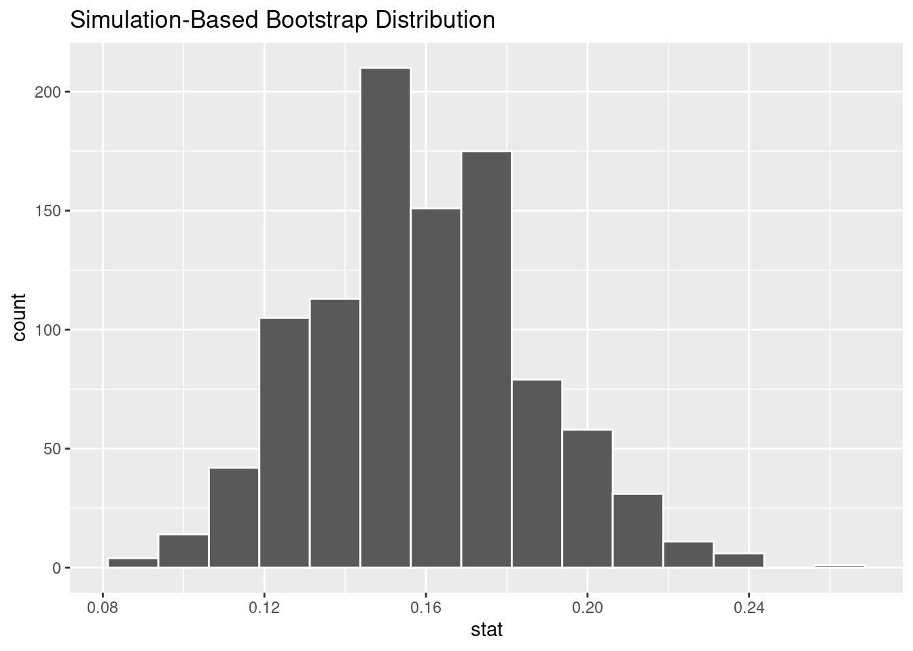
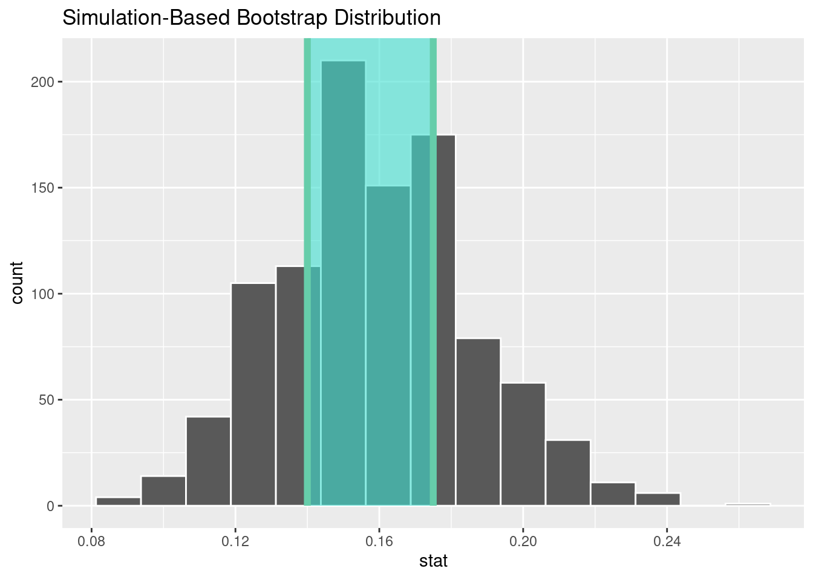
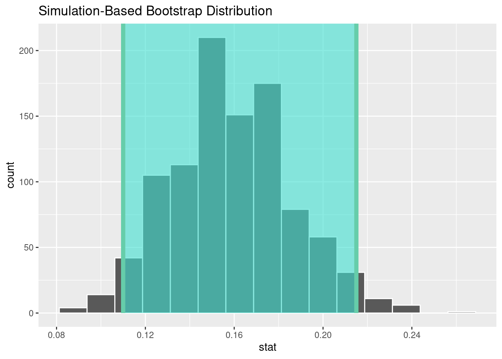

# Confidence intervals {#ci}

<!-- Please don't mess with the next few lines! -->
<style>h5{font-size:2em;color:#0000FF}h6{font-size:1.5em;color:#0000FF}div.answer{margin-left:5%;border:1px solid #0000FF;border-left-width:10px;padding:25px} div.summary{background-color:rgba(30,144,255,0.1);border:3px double #0000FF;padding:25px}</style><p style="color:#ffffff">2.0</p>
<!-- Please don't mess with the previous few lines! -->

::: {.summary}


### Functions introduced in this chapter {-}

`get_confidence_interval`, `shade_confidence_interval`, `fct_collapse`

:::


## Introduction {#ci-intro}

Sampling variability means that we can never trust a single sample to identify a population parameter exactly. Instead of simply trusting a point estimate, we can look at the entire sampling distribution to create an interval of plausible values called a confidence interval. By making our intervals wide enough, we hope to have some chance of capturing the true population value. Like hypothesis tests, confidence intervals are a form of inference because they use a sample to deduce something about the population. Along the way, we will also learn about a new form of randomization called *bootstrapping*. 

### Install new packages {#ci-install}

There are no new packages used in this chapter.

### Download the R notebook file {#ci-download}

Check the upper-right corner in RStudio to make sure you're in your `intro_stats` project. Then click on the following link to download this chapter as an R notebook file (`.Rmd`).

<a href = "https://vectorposse.github.io/intro_stats/chapter_downloads/12-confidence_intervals.Rmd" download>https://vectorposse.github.io/intro_stats/chapter_downloads/12-confidence_intervals.Rmd</a>

Once the file is downloaded, move it to your project folder in RStudio and open it there.

### Restart R and run all chunks {#ci-restart}

In RStudio, select "Restart R and Run All Chunks" from the "Run" menu.

## Load packages {#ci-load}

We load the standard `tidyverse`, `janitor`, and `infer` packages. We'll also need the `openintro` package later in the chapter for the `hsb2` and the `smoking` data set.


```r
library(tidyverse)
```

```
## ── Attaching core tidyverse packages ──────────────────────── tidyverse 2.0.0 ──
## ✔ dplyr     1.1.2     ✔ readr     2.1.4
## ✔ forcats   1.0.0     ✔ stringr   1.5.0
## ✔ ggplot2   3.4.2     ✔ tibble    3.2.1
## ✔ lubridate 1.9.2     ✔ tidyr     1.3.0
## ✔ purrr     1.0.2     
## ── Conflicts ────────────────────────────────────────── tidyverse_conflicts() ──
## ✖ dplyr::filter() masks stats::filter()
## ✖ dplyr::lag()    masks stats::lag()
## ℹ Use the conflicted package (<http://conflicted.r-lib.org/>) to force all conflicts to become errors
```

```r
library(janitor)
```

```
## 
## Attaching package: 'janitor'
## 
## The following objects are masked from 'package:stats':
## 
##     chisq.test, fisher.test
```

```r
library(infer)
library(openintro)
```

```
## Loading required package: airports
## Loading required package: cherryblossom
## Loading required package: usdata
```


## Bootstrapping {#ci-boot}

Imagine you obtain a random sample of 200 high school seniors from across the U.S. Suppose 32 of them attend private school. As a sample statistic, we have

$$
\hat{p} = 32/200 = 0.16
$$
In other words, 16% of the students in the sample attended private school.

If our sample is representative, we might guess that the true population parameter $p$ is also close to 0.16, but we're not really sure:

$$
p \approx 0.16?
$$

And what about the sampling variability? A few chapters ago, we flipped coins. A "weighted" coin flipped 200 times can give us a "new" (fake) sample, and doing that a thousand times (or even more) can give us a lot of new samples to see what range of values is possible. But what would we use as the probability of heads for the weighted coin? It would be a bad idea to use 0.16 because that would assume that the population proportion agreed exactly with the one sample we happen to have. It worked in a hypothesis test because we had a value of $p$ we assumed was true in the guise of a null hypothesis. But in general, if I simply want to estimate a population parameter with a sample statistic, I have no such information to use. So coin flipping is out.

An alternative that is available to us is a procedure called *bootstrapping*. The idea sounds weird, but it's pretty simple: instead of building fake samples, what if we tried to build a fake population? And then, what if we took repeated samples from it?

How would we build a fake population? Imagine making many, many copies of our sample until we had thousands or even millions of students. In fact, we can think of an infinite number of copies of our sample if we want. Sure, this fake population isn't exactly like the real population of all high school seniors. But if our sample is representative, we might hope that lots of copies of our sample would approximate the population we care about.

Computationally, it's a lot of work to copy our sample thousands or millions of times. And we certainly can't work with an infinite number of copies. Fortunately, we can use a shortcut. It's called *sampling with replacement*.

Normal sampling is usually *without replacement*, meaning that once we have sampled an individual, they are not eligible to be sampled again. We don't want to survey Billy and then later in our study, survey Billy again.

In sampling *with* replacement, we put Billy back in the pool and make him eligible to be sampled again. This is the same thing as having access to an infinite population. Remember that our fake population is just many, many copies of our sample. So in that fake population, there are many, many Billy clones that could end up in our sample. So rather than cloning Billy many, many times, let's just put Billy back in the group any time he's sampled.

We need to see this in action. We have a random sample of 200 students obtained by the National Center of Education Statistics in their "High School and Beyond" survey. This is stored in the `hsb2` data set from the `openintro` package. Here are the school types for these students, stored in the variable `schtyp`:


```r
hsb2$schtyp
```

```
##   [1] public  public  public  public  public  public  public  public  public 
##  [10] public  public  public  public  public  public  public  public  private
##  [19] public  public  public  public  public  public  public  public  public 
##  [28] private private public  public  public  private public  private public 
##  [37] private public  public  public  private private public  public  public 
##  [46] public  public  public  private public  public  public  public  private
##  [55] public  public  public  public  private public  private public  public 
##  [64] public  private public  public  public  public  public  public  public 
##  [73] public  public  public  public  public  public  public  public  public 
##  [82] public  private public  public  public  public  public  public  public 
##  [91] public  public  public  public  public  public  public  public  public 
## [100] private public  public  public  public  public  public  public  public 
## [109] private private public  public  public  public  private public  public 
## [118] public  public  public  private public  public  public  public  public 
## [127] public  public  public  public  public  public  public  public  public 
## [136] public  private public  public  private public  public  public  public 
## [145] public  private public  private public  public  public  public  public 
## [154] public  public  public  public  public  public  public  public  public 
## [163] private public  public  public  public  public  private public  public 
## [172] public  public  public  public  public  public  public  public  public 
## [181] public  private public  public  public  public  public  public  private
## [190] public  public  private private public  private private public  private
## [199] public  public 
## Levels: public private
```

Let's sample an individual from our sample:


```r
set.seed(6)
sample(hsb2$schtyp, size = 1)
```

```
## [1] public
## Levels: public private
```

That was one of the public school students from among the 200 students in our sample. Here's another one:


```r
set.seed(7)
sample(hsb2$schtyp, size = 1)
```

```
## [1] private
## Levels: public private
```

That was one of the private school students.

We can do this 200 times. Now, if we sample *without* replacement, all we get back are the original students, just listed in a different order. Think about why: we're just picking one student at a time. But since they don't get replaced, eventually, every student will get chosen. We're choosing 200 students, but there are only 200 students from which to choose.


```r
set.seed(8)
sample_without_replacement1 <- sample(hsb2$schtyp, size = 200)
sample_without_replacement1
```

```
##   [1] public  public  public  public  public  public  public  public  public 
##  [10] public  public  public  public  public  public  public  private public 
##  [19] public  public  public  public  public  public  public  public  public 
##  [28] public  public  private public  public  public  public  public  public 
##  [37] public  public  public  public  public  public  public  private public 
##  [46] public  public  public  public  private private private public  public 
##  [55] private private public  public  public  public  public  public  private
##  [64] public  public  private public  public  public  public  public  public 
##  [73] public  public  public  public  public  public  public  public  public 
##  [82] public  public  public  public  public  public  public  public  public 
##  [91] public  public  public  public  public  public  public  public  public 
## [100] public  public  private public  public  public  public  public  public 
## [109] public  public  public  public  public  public  public  public  public 
## [118] public  public  public  private public  public  private public  public 
## [127] private private public  public  public  public  private public  private
## [136] private public  public  public  public  public  public  public  public 
## [145] public  public  public  public  public  public  public  public  private
## [154] public  public  public  public  public  private public  private private
## [163] public  public  public  public  private public  public  private public 
## [172] private private public  public  public  public  public  public  public 
## [181] public  private public  private public  public  public  private private
## [190] public  public  public  public  public  public  public  public  private
## [199] public  private
## Levels: public private
```


```r
tabyl(sample_without_replacement1)
```

<div data-pagedtable="false">
  <script data-pagedtable-source type="application/json">
{"columns":[{"label":["sample_without_replacement1"],"name":[1],"type":["fct"],"align":["left"]},{"label":["n"],"name":[2],"type":["int"],"align":["right"]},{"label":["percent"],"name":[3],"type":["dbl"],"align":["right"]}],"data":[{"1":"public","2":"168","3":"0.84"},{"1":"private","2":"32","3":"0.16"}],"options":{"columns":{"min":{},"max":[10]},"rows":{"min":[10],"max":[10]},"pages":{}}}
  </script>
</div>


```r
set.seed(9)
sample_without_replacement2 <- sample(hsb2$schtyp, size = 200)
sample_without_replacement2
```

```
##   [1] public  public  public  private public  private public  private public 
##  [10] public  public  private private private private private public  public 
##  [19] private public  public  public  public  public  public  public  public 
##  [28] public  public  public  public  public  public  public  public  public 
##  [37] public  public  public  public  public  public  public  private public 
##  [46] public  public  public  public  private public  private public  public 
##  [55] public  private public  public  public  public  public  public  public 
##  [64] private public  public  public  public  public  public  public  public 
##  [73] public  public  public  public  private public  public  public  public 
##  [82] private private public  public  public  public  public  public  private
##  [91] public  private public  public  public  private public  public  public 
## [100] public  public  private private public  public  public  public  public 
## [109] public  private public  public  private public  private public  public 
## [118] public  public  public  public  public  private public  public  public 
## [127] public  public  public  public  public  public  public  public  public 
## [136] public  public  public  public  public  public  private public  public 
## [145] public  private public  public  public  public  public  public  public 
## [154] public  public  public  public  public  public  public  public  private
## [163] private public  public  public  public  public  public  public  public 
## [172] public  public  public  public  public  public  public  public  public 
## [181] private public  public  public  public  public  private public  public 
## [190] public  public  public  public  public  public  public  public  public 
## [199] public  public 
## Levels: public private
```


```r
tabyl(sample_without_replacement2)
```

<div data-pagedtable="false">
  <script data-pagedtable-source type="application/json">
{"columns":[{"label":["sample_without_replacement2"],"name":[1],"type":["fct"],"align":["left"]},{"label":["n"],"name":[2],"type":["int"],"align":["right"]},{"label":["percent"],"name":[3],"type":["dbl"],"align":["right"]}],"data":[{"1":"public","2":"168","3":"0.84"},{"1":"private","2":"32","3":"0.16"}],"options":{"columns":{"min":{},"max":[10]},"rows":{"min":[10],"max":[10]},"pages":{}}}
  </script>
</div>

The two lists above consist of the same 200 students, just drawn in a different order.

On the other hand, if we sample *with* replacement, then students can get chosen more than once. (Remember, we're equating "getting chosen more than once" with "sampling from an infinite population and choosing a clone".) Now, the number of private school students we see might not be 32.

Each of the following samples is called a *bootstrap sample*. Notice that we've added the argument `replace = TRUE` to the `sample` function:


```r
set.seed(10)
sample_with_replacement1 <- sample(hsb2$schtyp, size = 200, replace = TRUE)
sample_with_replacement1
```

```
##   [1] private public  public  public  public  private public  public  public 
##  [10] public  public  public  public  public  public  public  public  public 
##  [19] private public  public  public  public  private private private public 
##  [28] public  private public  public  public  private public  public  public 
##  [37] public  public  public  public  public  public  private public  public 
##  [46] public  public  public  public  public  public  private public  public 
##  [55] public  public  public  public  public  public  public  public  public 
##  [64] public  public  private public  private public  public  public  private
##  [73] public  public  public  public  public  public  public  public  public 
##  [82] public  public  public  public  private public  public  public  public 
##  [91] public  private public  private public  private public  public  public 
## [100] public  public  public  private private public  public  public  public 
## [109] public  public  public  public  public  private private public  public 
## [118] private public  public  private public  public  private public  public 
## [127] public  public  public  private private private public  public  private
## [136] public  public  public  public  public  public  public  public  public 
## [145] public  public  public  public  public  public  public  public  public 
## [154] public  public  public  public  public  public  public  private public 
## [163] public  public  public  private private public  private private private
## [172] public  public  public  public  public  public  private public  public 
## [181] public  public  public  public  public  public  private public  public 
## [190] public  public  public  public  public  public  public  public  public 
## [199] public  public 
## Levels: public private
```


```r
tabyl(sample_with_replacement1)
```

<div data-pagedtable="false">
  <script data-pagedtable-source type="application/json">
{"columns":[{"label":["sample_with_replacement1"],"name":[1],"type":["fct"],"align":["left"]},{"label":["n"],"name":[2],"type":["int"],"align":["right"]},{"label":["percent"],"name":[3],"type":["dbl"],"align":["right"]}],"data":[{"1":"public","2":"164","3":"0.82"},{"1":"private","2":"36","3":"0.18"}],"options":{"columns":{"min":{},"max":[10]},"rows":{"min":[10],"max":[10]},"pages":{}}}
  </script>
</div>

That bootstrap sample proportion is 0.18, not 0.16.


```r
set.seed(11)
sample_with_replacement2 <- sample(hsb2$schtyp, size = 200, replace = TRUE)
sample_with_replacement2
```

```
##   [1] public  public  public  public  public  private public  public  private
##  [10] public  public  private public  public  public  public  public  public 
##  [19] public  public  public  public  public  public  public  public  public 
##  [28] public  public  public  public  public  public  public  public  public 
##  [37] public  public  public  public  public  public  public  public  public 
##  [46] public  public  public  public  public  public  public  private public 
##  [55] public  public  public  public  public  public  public  public  public 
##  [64] public  public  public  public  public  public  public  public  public 
##  [73] public  public  public  public  private public  public  public  public 
##  [82] public  private private public  public  private public  public  public 
##  [91] public  private public  public  public  public  private public  private
## [100] public  public  private public  public  public  public  public  public 
## [109] public  public  private public  public  private public  public  public 
## [118] private private public  public  public  public  private public  private
## [127] public  private public  private public  public  public  private public 
## [136] private public  public  public  private private private public  private
## [145] public  public  private public  public  private public  public  public 
## [154] private private public  public  public  public  public  public  private
## [163] private public  public  public  public  public  private public  private
## [172] public  public  public  private private public  private public  public 
## [181] public  public  public  public  public  public  public  public  public 
## [190] public  private public  private public  public  public  private public 
## [199] public  public 
## Levels: public private
```


```r
tabyl(sample_with_replacement2)
```

<div data-pagedtable="false">
  <script data-pagedtable-source type="application/json">
{"columns":[{"label":["sample_with_replacement2"],"name":[1],"type":["fct"],"align":["left"]},{"label":["n"],"name":[2],"type":["int"],"align":["right"]},{"label":["percent"],"name":[3],"type":["dbl"],"align":["right"]}],"data":[{"1":"public","2":"160","3":"0.8"},{"1":"private","2":"40","3":"0.2"}],"options":{"columns":{"min":{},"max":[10]},"rows":{"min":[10],"max":[10]},"pages":{}}}
  </script>
</div>

That bootstrap sample proportion is 0.2.

Now we're getting some sampling variability!

If we do this many, many times, we get a whole collection of sample proportions. The distribution of all those sample proportions, obtained with bootstrap samples (samples drawn with replacement), is called the *bootstrap sampling distribution*.


## Computing a bootstrap sampling distribution {#ci-computing-boot}

The `infer` package can compute bootstrap samples and, hence, produce a bootstrap sampling distribution. The code looks a whole like the code you already know for hypothesis testing:


```r
private_boot <- hsb2 %>%
    specify(response = schtyp, success = "private") %>%
    generate(reps = 1000, type = "bootstrap") %>%
    calculate(stat = "prop")
private_boot
```

<div data-pagedtable="false">
  <script data-pagedtable-source type="application/json">
{"columns":[{"label":["replicate"],"name":[1],"type":["int"],"align":["right"]},{"label":["stat"],"name":[2],"type":["dbl"],"align":["right"]}],"data":[{"1":"1","2":"0.185"},{"1":"2","2":"0.185"},{"1":"3","2":"0.150"},{"1":"4","2":"0.135"},{"1":"5","2":"0.145"},{"1":"6","2":"0.175"},{"1":"7","2":"0.150"},{"1":"8","2":"0.195"},{"1":"9","2":"0.180"},{"1":"10","2":"0.185"},{"1":"11","2":"0.205"},{"1":"12","2":"0.140"},{"1":"13","2":"0.185"},{"1":"14","2":"0.175"},{"1":"15","2":"0.150"},{"1":"16","2":"0.165"},{"1":"17","2":"0.170"},{"1":"18","2":"0.160"},{"1":"19","2":"0.140"},{"1":"20","2":"0.180"},{"1":"21","2":"0.225"},{"1":"22","2":"0.180"},{"1":"23","2":"0.170"},{"1":"24","2":"0.180"},{"1":"25","2":"0.120"},{"1":"26","2":"0.165"},{"1":"27","2":"0.185"},{"1":"28","2":"0.175"},{"1":"29","2":"0.140"},{"1":"30","2":"0.155"},{"1":"31","2":"0.180"},{"1":"32","2":"0.145"},{"1":"33","2":"0.210"},{"1":"34","2":"0.205"},{"1":"35","2":"0.175"},{"1":"36","2":"0.135"},{"1":"37","2":"0.160"},{"1":"38","2":"0.160"},{"1":"39","2":"0.180"},{"1":"40","2":"0.160"},{"1":"41","2":"0.165"},{"1":"42","2":"0.140"},{"1":"43","2":"0.170"},{"1":"44","2":"0.175"},{"1":"45","2":"0.165"},{"1":"46","2":"0.110"},{"1":"47","2":"0.135"},{"1":"48","2":"0.110"},{"1":"49","2":"0.170"},{"1":"50","2":"0.110"},{"1":"51","2":"0.155"},{"1":"52","2":"0.150"},{"1":"53","2":"0.110"},{"1":"54","2":"0.120"},{"1":"55","2":"0.170"},{"1":"56","2":"0.165"},{"1":"57","2":"0.155"},{"1":"58","2":"0.120"},{"1":"59","2":"0.175"},{"1":"60","2":"0.145"},{"1":"61","2":"0.155"},{"1":"62","2":"0.190"},{"1":"63","2":"0.160"},{"1":"64","2":"0.155"},{"1":"65","2":"0.150"},{"1":"66","2":"0.165"},{"1":"67","2":"0.150"},{"1":"68","2":"0.170"},{"1":"69","2":"0.160"},{"1":"70","2":"0.135"},{"1":"71","2":"0.125"},{"1":"72","2":"0.215"},{"1":"73","2":"0.175"},{"1":"74","2":"0.165"},{"1":"75","2":"0.140"},{"1":"76","2":"0.170"},{"1":"77","2":"0.145"},{"1":"78","2":"0.180"},{"1":"79","2":"0.110"},{"1":"80","2":"0.125"},{"1":"81","2":"0.160"},{"1":"82","2":"0.205"},{"1":"83","2":"0.110"},{"1":"84","2":"0.190"},{"1":"85","2":"0.115"},{"1":"86","2":"0.155"},{"1":"87","2":"0.170"},{"1":"88","2":"0.120"},{"1":"89","2":"0.165"},{"1":"90","2":"0.175"},{"1":"91","2":"0.205"},{"1":"92","2":"0.175"},{"1":"93","2":"0.180"},{"1":"94","2":"0.145"},{"1":"95","2":"0.130"},{"1":"96","2":"0.160"},{"1":"97","2":"0.155"},{"1":"98","2":"0.180"},{"1":"99","2":"0.150"},{"1":"100","2":"0.195"},{"1":"101","2":"0.180"},{"1":"102","2":"0.210"},{"1":"103","2":"0.200"},{"1":"104","2":"0.090"},{"1":"105","2":"0.160"},{"1":"106","2":"0.220"},{"1":"107","2":"0.195"},{"1":"108","2":"0.145"},{"1":"109","2":"0.140"},{"1":"110","2":"0.115"},{"1":"111","2":"0.140"},{"1":"112","2":"0.180"},{"1":"113","2":"0.175"},{"1":"114","2":"0.135"},{"1":"115","2":"0.185"},{"1":"116","2":"0.175"},{"1":"117","2":"0.115"},{"1":"118","2":"0.125"},{"1":"119","2":"0.190"},{"1":"120","2":"0.155"},{"1":"121","2":"0.190"},{"1":"122","2":"0.145"},{"1":"123","2":"0.115"},{"1":"124","2":"0.160"},{"1":"125","2":"0.185"},{"1":"126","2":"0.155"},{"1":"127","2":"0.160"},{"1":"128","2":"0.160"},{"1":"129","2":"0.190"},{"1":"130","2":"0.140"},{"1":"131","2":"0.190"},{"1":"132","2":"0.115"},{"1":"133","2":"0.200"},{"1":"134","2":"0.180"},{"1":"135","2":"0.170"},{"1":"136","2":"0.145"},{"1":"137","2":"0.225"},{"1":"138","2":"0.175"},{"1":"139","2":"0.135"},{"1":"140","2":"0.200"},{"1":"141","2":"0.195"},{"1":"142","2":"0.145"},{"1":"143","2":"0.150"},{"1":"144","2":"0.215"},{"1":"145","2":"0.130"},{"1":"146","2":"0.185"},{"1":"147","2":"0.165"},{"1":"148","2":"0.110"},{"1":"149","2":"0.135"},{"1":"150","2":"0.135"},{"1":"151","2":"0.175"},{"1":"152","2":"0.215"},{"1":"153","2":"0.125"},{"1":"154","2":"0.145"},{"1":"155","2":"0.135"},{"1":"156","2":"0.200"},{"1":"157","2":"0.190"},{"1":"158","2":"0.160"},{"1":"159","2":"0.215"},{"1":"160","2":"0.185"},{"1":"161","2":"0.175"},{"1":"162","2":"0.140"},{"1":"163","2":"0.185"},{"1":"164","2":"0.150"},{"1":"165","2":"0.165"},{"1":"166","2":"0.145"},{"1":"167","2":"0.180"},{"1":"168","2":"0.160"},{"1":"169","2":"0.150"},{"1":"170","2":"0.170"},{"1":"171","2":"0.155"},{"1":"172","2":"0.155"},{"1":"173","2":"0.175"},{"1":"174","2":"0.120"},{"1":"175","2":"0.145"},{"1":"176","2":"0.170"},{"1":"177","2":"0.145"},{"1":"178","2":"0.150"},{"1":"179","2":"0.135"},{"1":"180","2":"0.105"},{"1":"181","2":"0.140"},{"1":"182","2":"0.160"},{"1":"183","2":"0.130"},{"1":"184","2":"0.185"},{"1":"185","2":"0.195"},{"1":"186","2":"0.140"},{"1":"187","2":"0.155"},{"1":"188","2":"0.180"},{"1":"189","2":"0.125"},{"1":"190","2":"0.140"},{"1":"191","2":"0.130"},{"1":"192","2":"0.185"},{"1":"193","2":"0.135"},{"1":"194","2":"0.165"},{"1":"195","2":"0.180"},{"1":"196","2":"0.190"},{"1":"197","2":"0.175"},{"1":"198","2":"0.195"},{"1":"199","2":"0.190"},{"1":"200","2":"0.175"},{"1":"201","2":"0.200"},{"1":"202","2":"0.170"},{"1":"203","2":"0.120"},{"1":"204","2":"0.155"},{"1":"205","2":"0.140"},{"1":"206","2":"0.145"},{"1":"207","2":"0.150"},{"1":"208","2":"0.170"},{"1":"209","2":"0.145"},{"1":"210","2":"0.170"},{"1":"211","2":"0.150"},{"1":"212","2":"0.170"},{"1":"213","2":"0.165"},{"1":"214","2":"0.115"},{"1":"215","2":"0.135"},{"1":"216","2":"0.140"},{"1":"217","2":"0.165"},{"1":"218","2":"0.130"},{"1":"219","2":"0.170"},{"1":"220","2":"0.150"},{"1":"221","2":"0.130"},{"1":"222","2":"0.185"},{"1":"223","2":"0.205"},{"1":"224","2":"0.130"},{"1":"225","2":"0.170"},{"1":"226","2":"0.215"},{"1":"227","2":"0.185"},{"1":"228","2":"0.140"},{"1":"229","2":"0.140"},{"1":"230","2":"0.130"},{"1":"231","2":"0.165"},{"1":"232","2":"0.160"},{"1":"233","2":"0.210"},{"1":"234","2":"0.140"},{"1":"235","2":"0.135"},{"1":"236","2":"0.140"},{"1":"237","2":"0.155"},{"1":"238","2":"0.155"},{"1":"239","2":"0.130"},{"1":"240","2":"0.145"},{"1":"241","2":"0.225"},{"1":"242","2":"0.180"},{"1":"243","2":"0.150"},{"1":"244","2":"0.185"},{"1":"245","2":"0.160"},{"1":"246","2":"0.150"},{"1":"247","2":"0.185"},{"1":"248","2":"0.120"},{"1":"249","2":"0.120"},{"1":"250","2":"0.140"},{"1":"251","2":"0.185"},{"1":"252","2":"0.165"},{"1":"253","2":"0.175"},{"1":"254","2":"0.165"},{"1":"255","2":"0.155"},{"1":"256","2":"0.145"},{"1":"257","2":"0.140"},{"1":"258","2":"0.185"},{"1":"259","2":"0.165"},{"1":"260","2":"0.155"},{"1":"261","2":"0.150"},{"1":"262","2":"0.145"},{"1":"263","2":"0.145"},{"1":"264","2":"0.150"},{"1":"265","2":"0.150"},{"1":"266","2":"0.210"},{"1":"267","2":"0.210"},{"1":"268","2":"0.225"},{"1":"269","2":"0.190"},{"1":"270","2":"0.160"},{"1":"271","2":"0.120"},{"1":"272","2":"0.215"},{"1":"273","2":"0.175"},{"1":"274","2":"0.085"},{"1":"275","2":"0.145"},{"1":"276","2":"0.175"},{"1":"277","2":"0.165"},{"1":"278","2":"0.155"},{"1":"279","2":"0.145"},{"1":"280","2":"0.165"},{"1":"281","2":"0.135"},{"1":"282","2":"0.155"},{"1":"283","2":"0.175"},{"1":"284","2":"0.170"},{"1":"285","2":"0.125"},{"1":"286","2":"0.160"},{"1":"287","2":"0.165"},{"1":"288","2":"0.160"},{"1":"289","2":"0.185"},{"1":"290","2":"0.145"},{"1":"291","2":"0.135"},{"1":"292","2":"0.215"},{"1":"293","2":"0.195"},{"1":"294","2":"0.135"},{"1":"295","2":"0.155"},{"1":"296","2":"0.205"},{"1":"297","2":"0.125"},{"1":"298","2":"0.130"},{"1":"299","2":"0.195"},{"1":"300","2":"0.175"},{"1":"301","2":"0.165"},{"1":"302","2":"0.180"},{"1":"303","2":"0.170"},{"1":"304","2":"0.160"},{"1":"305","2":"0.140"},{"1":"306","2":"0.115"},{"1":"307","2":"0.120"},{"1":"308","2":"0.180"},{"1":"309","2":"0.175"},{"1":"310","2":"0.095"},{"1":"311","2":"0.190"},{"1":"312","2":"0.125"},{"1":"313","2":"0.125"},{"1":"314","2":"0.145"},{"1":"315","2":"0.180"},{"1":"316","2":"0.155"},{"1":"317","2":"0.145"},{"1":"318","2":"0.140"},{"1":"319","2":"0.205"},{"1":"320","2":"0.175"},{"1":"321","2":"0.130"},{"1":"322","2":"0.180"},{"1":"323","2":"0.200"},{"1":"324","2":"0.165"},{"1":"325","2":"0.150"},{"1":"326","2":"0.150"},{"1":"327","2":"0.190"},{"1":"328","2":"0.105"},{"1":"329","2":"0.135"},{"1":"330","2":"0.145"},{"1":"331","2":"0.165"},{"1":"332","2":"0.150"},{"1":"333","2":"0.110"},{"1":"334","2":"0.180"},{"1":"335","2":"0.165"},{"1":"336","2":"0.155"},{"1":"337","2":"0.150"},{"1":"338","2":"0.120"},{"1":"339","2":"0.140"},{"1":"340","2":"0.125"},{"1":"341","2":"0.180"},{"1":"342","2":"0.195"},{"1":"343","2":"0.135"},{"1":"344","2":"0.185"},{"1":"345","2":"0.120"},{"1":"346","2":"0.150"},{"1":"347","2":"0.210"},{"1":"348","2":"0.170"},{"1":"349","2":"0.200"},{"1":"350","2":"0.155"},{"1":"351","2":"0.235"},{"1":"352","2":"0.180"},{"1":"353","2":"0.140"},{"1":"354","2":"0.200"},{"1":"355","2":"0.165"},{"1":"356","2":"0.135"},{"1":"357","2":"0.165"},{"1":"358","2":"0.165"},{"1":"359","2":"0.175"},{"1":"360","2":"0.125"},{"1":"361","2":"0.155"},{"1":"362","2":"0.200"},{"1":"363","2":"0.160"},{"1":"364","2":"0.145"},{"1":"365","2":"0.140"},{"1":"366","2":"0.180"},{"1":"367","2":"0.155"},{"1":"368","2":"0.220"},{"1":"369","2":"0.165"},{"1":"370","2":"0.200"},{"1":"371","2":"0.155"},{"1":"372","2":"0.205"},{"1":"373","2":"0.125"},{"1":"374","2":"0.160"},{"1":"375","2":"0.105"},{"1":"376","2":"0.180"},{"1":"377","2":"0.110"},{"1":"378","2":"0.215"},{"1":"379","2":"0.145"},{"1":"380","2":"0.160"},{"1":"381","2":"0.175"},{"1":"382","2":"0.125"},{"1":"383","2":"0.180"},{"1":"384","2":"0.195"},{"1":"385","2":"0.165"},{"1":"386","2":"0.135"},{"1":"387","2":"0.140"},{"1":"388","2":"0.180"},{"1":"389","2":"0.140"},{"1":"390","2":"0.140"},{"1":"391","2":"0.200"},{"1":"392","2":"0.150"},{"1":"393","2":"0.125"},{"1":"394","2":"0.140"},{"1":"395","2":"0.125"},{"1":"396","2":"0.160"},{"1":"397","2":"0.180"},{"1":"398","2":"0.230"},{"1":"399","2":"0.150"},{"1":"400","2":"0.155"},{"1":"401","2":"0.100"},{"1":"402","2":"0.140"},{"1":"403","2":"0.155"},{"1":"404","2":"0.220"},{"1":"405","2":"0.135"},{"1":"406","2":"0.165"},{"1":"407","2":"0.140"},{"1":"408","2":"0.150"},{"1":"409","2":"0.150"},{"1":"410","2":"0.140"},{"1":"411","2":"0.150"},{"1":"412","2":"0.195"},{"1":"413","2":"0.200"},{"1":"414","2":"0.145"},{"1":"415","2":"0.130"},{"1":"416","2":"0.140"},{"1":"417","2":"0.145"},{"1":"418","2":"0.150"},{"1":"419","2":"0.150"},{"1":"420","2":"0.150"},{"1":"421","2":"0.155"},{"1":"422","2":"0.175"},{"1":"423","2":"0.135"},{"1":"424","2":"0.135"},{"1":"425","2":"0.150"},{"1":"426","2":"0.160"},{"1":"427","2":"0.125"},{"1":"428","2":"0.185"},{"1":"429","2":"0.165"},{"1":"430","2":"0.135"},{"1":"431","2":"0.145"},{"1":"432","2":"0.205"},{"1":"433","2":"0.140"},{"1":"434","2":"0.140"},{"1":"435","2":"0.170"},{"1":"436","2":"0.175"},{"1":"437","2":"0.160"},{"1":"438","2":"0.120"},{"1":"439","2":"0.190"},{"1":"440","2":"0.135"},{"1":"441","2":"0.180"},{"1":"442","2":"0.130"},{"1":"443","2":"0.150"},{"1":"444","2":"0.240"},{"1":"445","2":"0.185"},{"1":"446","2":"0.140"},{"1":"447","2":"0.175"},{"1":"448","2":"0.170"},{"1":"449","2":"0.145"},{"1":"450","2":"0.165"},{"1":"451","2":"0.150"},{"1":"452","2":"0.160"},{"1":"453","2":"0.140"},{"1":"454","2":"0.120"},{"1":"455","2":"0.145"},{"1":"456","2":"0.160"},{"1":"457","2":"0.155"},{"1":"458","2":"0.140"},{"1":"459","2":"0.155"},{"1":"460","2":"0.160"},{"1":"461","2":"0.155"},{"1":"462","2":"0.130"},{"1":"463","2":"0.145"},{"1":"464","2":"0.210"},{"1":"465","2":"0.195"},{"1":"466","2":"0.145"},{"1":"467","2":"0.175"},{"1":"468","2":"0.130"},{"1":"469","2":"0.185"},{"1":"470","2":"0.175"},{"1":"471","2":"0.195"},{"1":"472","2":"0.150"},{"1":"473","2":"0.180"},{"1":"474","2":"0.225"},{"1":"475","2":"0.185"},{"1":"476","2":"0.210"},{"1":"477","2":"0.180"},{"1":"478","2":"0.170"},{"1":"479","2":"0.170"},{"1":"480","2":"0.145"},{"1":"481","2":"0.140"},{"1":"482","2":"0.185"},{"1":"483","2":"0.140"},{"1":"484","2":"0.130"},{"1":"485","2":"0.180"},{"1":"486","2":"0.150"},{"1":"487","2":"0.180"},{"1":"488","2":"0.150"},{"1":"489","2":"0.145"},{"1":"490","2":"0.130"},{"1":"491","2":"0.150"},{"1":"492","2":"0.185"},{"1":"493","2":"0.140"},{"1":"494","2":"0.175"},{"1":"495","2":"0.135"},{"1":"496","2":"0.100"},{"1":"497","2":"0.215"},{"1":"498","2":"0.160"},{"1":"499","2":"0.150"},{"1":"500","2":"0.175"},{"1":"501","2":"0.110"},{"1":"502","2":"0.185"},{"1":"503","2":"0.160"},{"1":"504","2":"0.135"},{"1":"505","2":"0.160"},{"1":"506","2":"0.160"},{"1":"507","2":"0.185"},{"1":"508","2":"0.090"},{"1":"509","2":"0.195"},{"1":"510","2":"0.110"},{"1":"511","2":"0.170"},{"1":"512","2":"0.235"},{"1":"513","2":"0.120"},{"1":"514","2":"0.140"},{"1":"515","2":"0.190"},{"1":"516","2":"0.175"},{"1":"517","2":"0.155"},{"1":"518","2":"0.155"},{"1":"519","2":"0.125"},{"1":"520","2":"0.140"},{"1":"521","2":"0.175"},{"1":"522","2":"0.170"},{"1":"523","2":"0.150"},{"1":"524","2":"0.115"},{"1":"525","2":"0.150"},{"1":"526","2":"0.175"},{"1":"527","2":"0.130"},{"1":"528","2":"0.140"},{"1":"529","2":"0.130"},{"1":"530","2":"0.160"},{"1":"531","2":"0.180"},{"1":"532","2":"0.145"},{"1":"533","2":"0.195"},{"1":"534","2":"0.115"},{"1":"535","2":"0.195"},{"1":"536","2":"0.130"},{"1":"537","2":"0.145"},{"1":"538","2":"0.190"},{"1":"539","2":"0.215"},{"1":"540","2":"0.140"},{"1":"541","2":"0.120"},{"1":"542","2":"0.235"},{"1":"543","2":"0.170"},{"1":"544","2":"0.135"},{"1":"545","2":"0.170"},{"1":"546","2":"0.115"},{"1":"547","2":"0.165"},{"1":"548","2":"0.125"},{"1":"549","2":"0.155"},{"1":"550","2":"0.175"},{"1":"551","2":"0.155"},{"1":"552","2":"0.170"},{"1":"553","2":"0.140"},{"1":"554","2":"0.190"},{"1":"555","2":"0.150"},{"1":"556","2":"0.190"},{"1":"557","2":"0.190"},{"1":"558","2":"0.145"},{"1":"559","2":"0.155"},{"1":"560","2":"0.175"},{"1":"561","2":"0.125"},{"1":"562","2":"0.140"},{"1":"563","2":"0.195"},{"1":"564","2":"0.145"},{"1":"565","2":"0.155"},{"1":"566","2":"0.190"},{"1":"567","2":"0.165"},{"1":"568","2":"0.145"},{"1":"569","2":"0.180"},{"1":"570","2":"0.185"},{"1":"571","2":"0.190"},{"1":"572","2":"0.155"},{"1":"573","2":"0.165"},{"1":"574","2":"0.115"},{"1":"575","2":"0.180"},{"1":"576","2":"0.155"},{"1":"577","2":"0.145"},{"1":"578","2":"0.205"},{"1":"579","2":"0.145"},{"1":"580","2":"0.135"},{"1":"581","2":"0.155"},{"1":"582","2":"0.115"},{"1":"583","2":"0.115"},{"1":"584","2":"0.140"},{"1":"585","2":"0.115"},{"1":"586","2":"0.145"},{"1":"587","2":"0.145"},{"1":"588","2":"0.155"},{"1":"589","2":"0.165"},{"1":"590","2":"0.175"},{"1":"591","2":"0.190"},{"1":"592","2":"0.135"},{"1":"593","2":"0.160"},{"1":"594","2":"0.135"},{"1":"595","2":"0.150"},{"1":"596","2":"0.235"},{"1":"597","2":"0.130"},{"1":"598","2":"0.165"},{"1":"599","2":"0.220"},{"1":"600","2":"0.110"},{"1":"601","2":"0.115"},{"1":"602","2":"0.175"},{"1":"603","2":"0.130"},{"1":"604","2":"0.205"},{"1":"605","2":"0.105"},{"1":"606","2":"0.180"},{"1":"607","2":"0.215"},{"1":"608","2":"0.135"},{"1":"609","2":"0.135"},{"1":"610","2":"0.170"},{"1":"611","2":"0.170"},{"1":"612","2":"0.120"},{"1":"613","2":"0.165"},{"1":"614","2":"0.170"},{"1":"615","2":"0.110"},{"1":"616","2":"0.180"},{"1":"617","2":"0.130"},{"1":"618","2":"0.140"},{"1":"619","2":"0.155"},{"1":"620","2":"0.145"},{"1":"621","2":"0.190"},{"1":"622","2":"0.125"},{"1":"623","2":"0.240"},{"1":"624","2":"0.165"},{"1":"625","2":"0.170"},{"1":"626","2":"0.160"},{"1":"627","2":"0.130"},{"1":"628","2":"0.170"},{"1":"629","2":"0.175"},{"1":"630","2":"0.105"},{"1":"631","2":"0.210"},{"1":"632","2":"0.165"},{"1":"633","2":"0.150"},{"1":"634","2":"0.175"},{"1":"635","2":"0.170"},{"1":"636","2":"0.205"},{"1":"637","2":"0.100"},{"1":"638","2":"0.190"},{"1":"639","2":"0.165"},{"1":"640","2":"0.120"},{"1":"641","2":"0.165"},{"1":"642","2":"0.205"},{"1":"643","2":"0.175"},{"1":"644","2":"0.155"},{"1":"645","2":"0.170"},{"1":"646","2":"0.125"},{"1":"647","2":"0.205"},{"1":"648","2":"0.155"},{"1":"649","2":"0.170"},{"1":"650","2":"0.160"},{"1":"651","2":"0.145"},{"1":"652","2":"0.155"},{"1":"653","2":"0.165"},{"1":"654","2":"0.125"},{"1":"655","2":"0.185"},{"1":"656","2":"0.160"},{"1":"657","2":"0.105"},{"1":"658","2":"0.140"},{"1":"659","2":"0.150"},{"1":"660","2":"0.155"},{"1":"661","2":"0.150"},{"1":"662","2":"0.160"},{"1":"663","2":"0.175"},{"1":"664","2":"0.170"},{"1":"665","2":"0.135"},{"1":"666","2":"0.115"},{"1":"667","2":"0.120"},{"1":"668","2":"0.165"},{"1":"669","2":"0.160"},{"1":"670","2":"0.110"},{"1":"671","2":"0.130"},{"1":"672","2":"0.155"},{"1":"673","2":"0.160"},{"1":"674","2":"0.170"},{"1":"675","2":"0.140"},{"1":"676","2":"0.130"},{"1":"677","2":"0.190"},{"1":"678","2":"0.160"},{"1":"679","2":"0.165"},{"1":"680","2":"0.170"},{"1":"681","2":"0.195"},{"1":"682","2":"0.140"},{"1":"683","2":"0.130"},{"1":"684","2":"0.175"},{"1":"685","2":"0.215"},{"1":"686","2":"0.130"},{"1":"687","2":"0.190"},{"1":"688","2":"0.145"},{"1":"689","2":"0.195"},{"1":"690","2":"0.185"},{"1":"691","2":"0.115"},{"1":"692","2":"0.175"},{"1":"693","2":"0.210"},{"1":"694","2":"0.175"},{"1":"695","2":"0.170"},{"1":"696","2":"0.205"},{"1":"697","2":"0.140"},{"1":"698","2":"0.125"},{"1":"699","2":"0.160"},{"1":"700","2":"0.145"},{"1":"701","2":"0.170"},{"1":"702","2":"0.130"},{"1":"703","2":"0.165"},{"1":"704","2":"0.180"},{"1":"705","2":"0.190"},{"1":"706","2":"0.165"},{"1":"707","2":"0.200"},{"1":"708","2":"0.150"},{"1":"709","2":"0.130"},{"1":"710","2":"0.155"},{"1":"711","2":"0.210"},{"1":"712","2":"0.185"},{"1":"713","2":"0.170"},{"1":"714","2":"0.155"},{"1":"715","2":"0.150"},{"1":"716","2":"0.190"},{"1":"717","2":"0.150"},{"1":"718","2":"0.175"},{"1":"719","2":"0.165"},{"1":"720","2":"0.185"},{"1":"721","2":"0.170"},{"1":"722","2":"0.165"},{"1":"723","2":"0.170"},{"1":"724","2":"0.140"},{"1":"725","2":"0.175"},{"1":"726","2":"0.130"},{"1":"727","2":"0.185"},{"1":"728","2":"0.190"},{"1":"729","2":"0.160"},{"1":"730","2":"0.125"},{"1":"731","2":"0.165"},{"1":"732","2":"0.100"},{"1":"733","2":"0.105"},{"1":"734","2":"0.110"},{"1":"735","2":"0.130"},{"1":"736","2":"0.140"},{"1":"737","2":"0.155"},{"1":"738","2":"0.155"},{"1":"739","2":"0.160"},{"1":"740","2":"0.165"},{"1":"741","2":"0.155"},{"1":"742","2":"0.095"},{"1":"743","2":"0.130"},{"1":"744","2":"0.165"},{"1":"745","2":"0.150"},{"1":"746","2":"0.175"},{"1":"747","2":"0.170"},{"1":"748","2":"0.155"},{"1":"749","2":"0.150"},{"1":"750","2":"0.185"},{"1":"751","2":"0.155"},{"1":"752","2":"0.110"},{"1":"753","2":"0.165"},{"1":"754","2":"0.150"},{"1":"755","2":"0.120"},{"1":"756","2":"0.165"},{"1":"757","2":"0.145"},{"1":"758","2":"0.160"},{"1":"759","2":"0.185"},{"1":"760","2":"0.205"},{"1":"761","2":"0.185"},{"1":"762","2":"0.170"},{"1":"763","2":"0.120"},{"1":"764","2":"0.165"},{"1":"765","2":"0.155"},{"1":"766","2":"0.110"},{"1":"767","2":"0.170"},{"1":"768","2":"0.120"},{"1":"769","2":"0.120"},{"1":"770","2":"0.165"},{"1":"771","2":"0.130"},{"1":"772","2":"0.160"},{"1":"773","2":"0.165"},{"1":"774","2":"0.120"},{"1":"775","2":"0.140"},{"1":"776","2":"0.155"},{"1":"777","2":"0.155"},{"1":"778","2":"0.160"},{"1":"779","2":"0.180"},{"1":"780","2":"0.155"},{"1":"781","2":"0.170"},{"1":"782","2":"0.175"},{"1":"783","2":"0.185"},{"1":"784","2":"0.135"},{"1":"785","2":"0.200"},{"1":"786","2":"0.195"},{"1":"787","2":"0.215"},{"1":"788","2":"0.160"},{"1":"789","2":"0.160"},{"1":"790","2":"0.160"},{"1":"791","2":"0.170"},{"1":"792","2":"0.180"},{"1":"793","2":"0.160"},{"1":"794","2":"0.140"},{"1":"795","2":"0.130"},{"1":"796","2":"0.200"},{"1":"797","2":"0.110"},{"1":"798","2":"0.165"},{"1":"799","2":"0.175"},{"1":"800","2":"0.135"},{"1":"801","2":"0.165"},{"1":"802","2":"0.160"},{"1":"803","2":"0.210"},{"1":"804","2":"0.145"},{"1":"805","2":"0.165"},{"1":"806","2":"0.160"},{"1":"807","2":"0.120"},{"1":"808","2":"0.190"},{"1":"809","2":"0.185"},{"1":"810","2":"0.150"},{"1":"811","2":"0.135"},{"1":"812","2":"0.175"},{"1":"813","2":"0.160"},{"1":"814","2":"0.140"},{"1":"815","2":"0.125"},{"1":"816","2":"0.170"},{"1":"817","2":"0.150"},{"1":"818","2":"0.110"},{"1":"819","2":"0.165"},{"1":"820","2":"0.145"},{"1":"821","2":"0.170"},{"1":"822","2":"0.205"},{"1":"823","2":"0.140"},{"1":"824","2":"0.155"},{"1":"825","2":"0.125"},{"1":"826","2":"0.165"},{"1":"827","2":"0.190"},{"1":"828","2":"0.175"},{"1":"829","2":"0.135"},{"1":"830","2":"0.145"},{"1":"831","2":"0.150"},{"1":"832","2":"0.180"},{"1":"833","2":"0.165"},{"1":"834","2":"0.165"},{"1":"835","2":"0.130"},{"1":"836","2":"0.180"},{"1":"837","2":"0.150"},{"1":"838","2":"0.145"},{"1":"839","2":"0.150"},{"1":"840","2":"0.140"},{"1":"841","2":"0.150"},{"1":"842","2":"0.145"},{"1":"843","2":"0.170"},{"1":"844","2":"0.110"},{"1":"845","2":"0.215"},{"1":"846","2":"0.170"},{"1":"847","2":"0.165"},{"1":"848","2":"0.165"},{"1":"849","2":"0.150"},{"1":"850","2":"0.165"},{"1":"851","2":"0.120"},{"1":"852","2":"0.165"},{"1":"853","2":"0.180"},{"1":"854","2":"0.140"},{"1":"855","2":"0.165"},{"1":"856","2":"0.165"},{"1":"857","2":"0.185"},{"1":"858","2":"0.135"},{"1":"859","2":"0.160"},{"1":"860","2":"0.145"},{"1":"861","2":"0.205"},{"1":"862","2":"0.145"},{"1":"863","2":"0.165"},{"1":"864","2":"0.180"},{"1":"865","2":"0.145"},{"1":"866","2":"0.135"},{"1":"867","2":"0.155"},{"1":"868","2":"0.125"},{"1":"869","2":"0.140"},{"1":"870","2":"0.190"},{"1":"871","2":"0.160"},{"1":"872","2":"0.120"},{"1":"873","2":"0.165"},{"1":"874","2":"0.135"},{"1":"875","2":"0.190"},{"1":"876","2":"0.145"},{"1":"877","2":"0.210"},{"1":"878","2":"0.180"},{"1":"879","2":"0.170"},{"1":"880","2":"0.115"},{"1":"881","2":"0.130"},{"1":"882","2":"0.135"},{"1":"883","2":"0.180"},{"1":"884","2":"0.160"},{"1":"885","2":"0.175"},{"1":"886","2":"0.155"},{"1":"887","2":"0.145"},{"1":"888","2":"0.260"},{"1":"889","2":"0.170"},{"1":"890","2":"0.145"},{"1":"891","2":"0.190"},{"1":"892","2":"0.125"},{"1":"893","2":"0.090"},{"1":"894","2":"0.210"},{"1":"895","2":"0.210"},{"1":"896","2":"0.140"},{"1":"897","2":"0.115"},{"1":"898","2":"0.135"},{"1":"899","2":"0.175"},{"1":"900","2":"0.205"},{"1":"901","2":"0.160"},{"1":"902","2":"0.150"},{"1":"903","2":"0.110"},{"1":"904","2":"0.145"},{"1":"905","2":"0.195"},{"1":"906","2":"0.150"},{"1":"907","2":"0.165"},{"1":"908","2":"0.185"},{"1":"909","2":"0.155"},{"1":"910","2":"0.125"},{"1":"911","2":"0.100"},{"1":"912","2":"0.165"},{"1":"913","2":"0.165"},{"1":"914","2":"0.155"},{"1":"915","2":"0.130"},{"1":"916","2":"0.175"},{"1":"917","2":"0.120"},{"1":"918","2":"0.190"},{"1":"919","2":"0.125"},{"1":"920","2":"0.150"},{"1":"921","2":"0.160"},{"1":"922","2":"0.160"},{"1":"923","2":"0.165"},{"1":"924","2":"0.175"},{"1":"925","2":"0.130"},{"1":"926","2":"0.165"},{"1":"927","2":"0.180"},{"1":"928","2":"0.165"},{"1":"929","2":"0.130"},{"1":"930","2":"0.150"},{"1":"931","2":"0.135"},{"1":"932","2":"0.180"},{"1":"933","2":"0.140"},{"1":"934","2":"0.110"},{"1":"935","2":"0.155"},{"1":"936","2":"0.125"},{"1":"937","2":"0.165"},{"1":"938","2":"0.155"},{"1":"939","2":"0.165"},{"1":"940","2":"0.155"},{"1":"941","2":"0.145"},{"1":"942","2":"0.185"},{"1":"943","2":"0.155"},{"1":"944","2":"0.150"},{"1":"945","2":"0.175"},{"1":"946","2":"0.130"},{"1":"947","2":"0.130"},{"1":"948","2":"0.135"},{"1":"949","2":"0.120"},{"1":"950","2":"0.140"},{"1":"951","2":"0.170"},{"1":"952","2":"0.210"},{"1":"953","2":"0.170"},{"1":"954","2":"0.120"},{"1":"955","2":"0.130"},{"1":"956","2":"0.160"},{"1":"957","2":"0.155"},{"1":"958","2":"0.180"},{"1":"959","2":"0.140"},{"1":"960","2":"0.110"},{"1":"961","2":"0.185"},{"1":"962","2":"0.185"},{"1":"963","2":"0.220"},{"1":"964","2":"0.150"},{"1":"965","2":"0.140"},{"1":"966","2":"0.165"},{"1":"967","2":"0.130"},{"1":"968","2":"0.145"},{"1":"969","2":"0.160"},{"1":"970","2":"0.210"},{"1":"971","2":"0.145"},{"1":"972","2":"0.150"},{"1":"973","2":"0.150"},{"1":"974","2":"0.175"},{"1":"975","2":"0.165"},{"1":"976","2":"0.175"},{"1":"977","2":"0.175"},{"1":"978","2":"0.145"},{"1":"979","2":"0.200"},{"1":"980","2":"0.200"},{"1":"981","2":"0.155"},{"1":"982","2":"0.180"},{"1":"983","2":"0.160"},{"1":"984","2":"0.160"},{"1":"985","2":"0.150"},{"1":"986","2":"0.150"},{"1":"987","2":"0.190"},{"1":"988","2":"0.160"},{"1":"989","2":"0.180"},{"1":"990","2":"0.160"},{"1":"991","2":"0.160"},{"1":"992","2":"0.150"},{"1":"993","2":"0.135"},{"1":"994","2":"0.170"},{"1":"995","2":"0.155"},{"1":"996","2":"0.155"},{"1":"997","2":"0.195"},{"1":"998","2":"0.150"},{"1":"999","2":"0.175"},{"1":"1000","2":"0.170"}],"options":{"columns":{"min":{},"max":[10]},"rows":{"min":[10],"max":[10]},"pages":{}}}
  </script>
</div>

We simply changed the `type` to "bootstrap".

Now we visualize like normal:


```r
private_boot %>%
    visualize()
```



(We can change the number of bins if we want, but this number looks pretty good.)


## Confidence intervals {#ci-ci}

The histogram above simulates what might happen if we took many samples from our infinite "fake" population consisting of many copies of our original, actual sample data. On the lower end, we might see something like 8% private school students. On the upper end, we could see 25% or more private school students.

In the chapter about numerical data, we computed the IQR (interquartile range), which was the difference between the 25th percentile and the 75th percentile. The IQR was then the range of the middle 50% of the data. Let's use `infer` tools to calculate the middle 50% of the above distribution:


```r
private_50 <- private_boot %>%
    get_confidence_interval(level = 0.5)
private_50
```

<div data-pagedtable="false">
  <script data-pagedtable-source type="application/json">
{"columns":[{"label":["lower_ci"],"name":[1],"type":["dbl"],"align":["right"]},{"label":["upper_ci"],"name":[2],"type":["dbl"],"align":["right"]}],"data":[{"1":"0.14","2":"0.175"}],"options":{"columns":{"min":{},"max":[10]},"rows":{"min":[10],"max":[10]},"pages":{}}}
  </script>
</div>

The middle 50% ranges from 14% up to 17.5%. We can also visualize this:


```r
private_boot %>%
    visualise() +
    shade_confidence_interval(endpoints = private_50)
```



In other words, when we go out to gather a sample from our (fake infinite) population of high school seniors, about half of the time, we expect the percentage of private students to be somewhere between 14% and 17.5%. The other half of the time, we will sample a value outside that range.

This is a confidence interval. More specifically, this is a 50% confidence interval. This is the range of values we expect sample proportions to be in approximately half of the samples we might gather from our (fake infinite) population.

Now don't forget the goal. What we are really trying to find is the value $p$, the true population parameter. We want to know what proportion of high school seniors attend private school in the whole population of all high school seniors in the U.S.

For mathematical reasons that are outside the scope of this course, it turns out that the sampling variability in the bootstrap distribution around $\hat{p}$ is very similar to the sampling variability of the sample proportion $\hat{p}$ around the true value $p$. We bootstrapped our way to the picture above using one actual sample with about 16% private school students. A different sample of high school seniors would give us different bootstrap samples, producing a slightly different bootstrap distribution from the one above. But it, too, will have a shaded region like the histogram above. Every actual sample we might obtain in the real world would give us a bootstrap distribution with a different shaded region. But the amazing fact is this: about half of those shaded regions will actually contain the true population parameter $p$.

Think about the value $p$ like a fish hidden in a murky lake. The sample proportion $\hat{p}$ is our attempt at fishing. We drop a hook down at the value $\hat{p}$ and pull it right back up. It's not very likely that we caught the fish, although we hope that we were close. Alas, the sample proportion is almost never exactly equal to the true proportion $p$. But what if we cast a net instead? That net is the shaded range of values in our confidence interval. That range of values might catch the fish.

The difference between statistics and fishing is that, in the latter, when we pull up the net, we can see if we successfully caught the fish. In the former, all we can say is that there is some probability that the net caught the fish, but you're not able to look inside the net to know for sure.

So the confidence interval we created above might have caught the true value $p$. But then again, it might not have. There's only a 50% chance we captured the true value in the range 14% to 17.5% that we computed from our specific sample with its accompanying bootstrap samples. Most researchers would be displeased with only a 50% success rate. So can we do better?

How much better do we want to do? This is a subjective question with no definitive answer. Many people say they want to be 95% confident that the confidence interval they build will capture the true population parameter. Let's modify our code to do that:


```r
private_95 <- private_boot %>%
    get_confidence_interval(level = 0.95)
private_95
```

<div data-pagedtable="false">
  <script data-pagedtable-source type="application/json">
{"columns":[{"label":["lower_ci"],"name":[1],"type":["dbl"],"align":["right"]},{"label":["upper_ci"],"name":[2],"type":["dbl"],"align":["right"]}],"data":[{"1":"0.11","2":"0.215"}],"options":{"columns":{"min":{},"max":[10]},"rows":{"min":[10],"max":[10]},"pages":{}}}
  </script>
</div>

The middle 95% ranges from 11% up to 21.5%. We can also visualize this:


```r
private_boot %>%
    visualise() +
    shade_confidence_interval(endpoints = private_95)
```



The interpretation is that when you go collect many samples, the confidence intervals you produce using the bootstrap procedure described above will capture the true population proportion 95% of the time.

##### Exercise 1 {-}

Why is a 95% confidence interval wider than a 50% confidence interval? In other words, why should our desire to be 95% confident in capturing the true value of $p$ result in an interval that is wider than if we only wanted to be 50% confident?

::: {.answer}

Please write up your answer here.

:::

##### Exercise 2 {-}

Being more confident seems like a good thing. In fact, we might want a 99% confidence interval. Compute and visualize a 99% confidence interval for proportion of private school students.

::: {.answer}


```r
# Add code here to compute a 99% confidence interval
```


```r
# Add code here to visualize a 99% confidence interval
```

:::

##### Exercise 3 {-}

Can you think of any downside to using higher and higher confidence levels? As a hint, think about the following completely true sentence: "I am 100% confident that the true proportion of high school seniors attending private school is somewhere between 0% and 100%."


::: {.answer}

Please write up your answer here.

:::

*****


While 50% is clearly too low for a confidence level, as seen above, there is no particular reason that we need to compute a 95% confidence interval either. There is some consensus in the scientific community here: 95% has evolved to become a generally agreed-upon standard. But we could compute a 90% confidence interval or a 99% confidence interval (as you did above), or any other type of interval. Having said that, if you choose other intervals besides these three, people might wonder if you're up to something.^[A contrary position is proffered by Richard McElreath, an evolutionary ecologist and author of the amazing book *Statistical Rethinking*. He uses 89% and 97% intervals to highlight the absurdity of regarding 95% as a magic number that has some kind of deep, special meaning.]


## Conditions {#ci-conditions}

Don't forget that there are always assumptions we make when relying on any kind of statistical inference. Before computing a confidence interval for a proportion, we must verify that certain conditions are satisfied. But these conditions are not new. We already know from hypothesis testing what is required for good inference from a sample. These are the "Random" and the "10%" conditions.

- Random
  - The sample must be random (or hopefully representative).
- 10%
  - The sample size must be less than 10% of the size of the population.

Both conditions are met for the data in the High School and Beyond survey.


## Rubric for confidence intervals {#ci-rubric}

Typically, you will be asked to report a confidence interval after performing a hypothesis test. Whereas a hypothesis test gives you a "decision criterion" (using data to make a decision to reject the null or fail to reject the null), a confidence interval gives you an estimate of the "effect size" (a range of plausible values for the population parameter).

As such, there is a section in the [Rubric for inference](#appendix-rubric) that shows the steps of calculating and reporting a confidence interval. They are as follows:

1. Check the relevant conditions to ensure that model assumptions are met.
2. Calculate and graph the confidence interval.
3. State (but do not overstate) a contextually meaningful interpretation.
4. If running a two-sided test, explain how the confidence interval reinforces the conclusion of the hypothesis test.
5.  When comparing two groups, comment on the effect size and the practical significance of the result.


## Example {#ci-ex}

Here is a worked example. (Unless otherwise stated, we always use a 95% confidence level.)

Some of the students in the "High School and Beyond" survey attended vocational programs. This data is stored in the `prog` variable. Using a confidence interval, estimate what percentage of all high school seniors attend vocational programs.

We will need to do a little data cleaning before we can address this question. There are actually three types of programs: "general", "academic", and "vocational". The `infer` commands will only work when a categorical variable has two levels. We are thinking of "general" and "academic" together as more like a combined "other" category. We can fix this by creating a new factor variable with `mutate`. Inside that `mutate`, we will use the `fct_collapse` function to collapse two of the levels into one as follows:


```r
hsb2 <- hsb2 %>%
    mutate(prog2 = fct_collapse(prog,
                                vocational = "vocational",
                                other = c("general", "academic")))
glimpse(hsb2)
```

```
## Rows: 200
## Columns: 12
## $ id      <int> 70, 121, 86, 141, 172, 113, 50, 11, 84, 48, 75, 60, 95, 104, 3…
## $ gender  <chr> "male", "female", "male", "male", "male", "male", "male", "mal…
## $ race    <chr> "white", "white", "white", "white", "white", "white", "african…
## $ ses     <fct> low, middle, high, high, middle, middle, middle, middle, middl…
## $ schtyp  <fct> public, public, public, public, public, public, public, public…
## $ prog    <fct> general, vocational, general, vocational, academic, academic, …
## $ read    <int> 57, 68, 44, 63, 47, 44, 50, 34, 63, 57, 60, 57, 73, 54, 45, 42…
## $ write   <int> 52, 59, 33, 44, 52, 52, 59, 46, 57, 55, 46, 65, 60, 63, 57, 49…
## $ math    <int> 41, 53, 54, 47, 57, 51, 42, 45, 54, 52, 51, 51, 71, 57, 50, 43…
## $ science <int> 47, 63, 58, 53, 53, 63, 53, 39, 58, 50, 53, 63, 61, 55, 31, 50…
## $ socst   <int> 57, 61, 31, 56, 61, 61, 61, 36, 51, 51, 61, 61, 71, 46, 56, 56…
## $ prog2   <fct> other, vocational, other, vocational, other, other, other, oth…
```

Inspect the variables `prog` and `prog2` above to make sure that the recoding was successful. Then be sure to use `prog2` and not `prog` everywhere.

### Check the relevant conditions to ensure that model assumptions are met. {#ci-ex-conditions}

- Random
  - The sample is a random sample of high school seniors from the U.S. as the survey was conducted by the National Center of Education Statistics, a reputable government organization.
- 10%
  - The sample size is 200, which is much less than 10% of the population of all U.S. high school seniors.

### Calculate and graph the confidence interval. {#ci-ex-calcaulte}


```r
vocational_boot <- hsb2 %>%
    specify(response = prog2, success = "vocational") %>%
    generate(reps = 1000, type = "bootstrap") %>%
    calculate(stat = "prop")
vocational_boot
```

<div data-pagedtable="false">
  <script data-pagedtable-source type="application/json">
{"columns":[{"label":["replicate"],"name":[1],"type":["int"],"align":["right"]},{"label":["stat"],"name":[2],"type":["dbl"],"align":["right"]}],"data":[{"1":"1","2":"0.335"},{"1":"2","2":"0.250"},{"1":"3","2":"0.170"},{"1":"4","2":"0.240"},{"1":"5","2":"0.245"},{"1":"6","2":"0.245"},{"1":"7","2":"0.200"},{"1":"8","2":"0.240"},{"1":"9","2":"0.265"},{"1":"10","2":"0.250"},{"1":"11","2":"0.295"},{"1":"12","2":"0.175"},{"1":"13","2":"0.225"},{"1":"14","2":"0.270"},{"1":"15","2":"0.230"},{"1":"16","2":"0.260"},{"1":"17","2":"0.265"},{"1":"18","2":"0.275"},{"1":"19","2":"0.315"},{"1":"20","2":"0.250"},{"1":"21","2":"0.270"},{"1":"22","2":"0.265"},{"1":"23","2":"0.225"},{"1":"24","2":"0.205"},{"1":"25","2":"0.240"},{"1":"26","2":"0.250"},{"1":"27","2":"0.255"},{"1":"28","2":"0.230"},{"1":"29","2":"0.295"},{"1":"30","2":"0.250"},{"1":"31","2":"0.290"},{"1":"32","2":"0.270"},{"1":"33","2":"0.210"},{"1":"34","2":"0.215"},{"1":"35","2":"0.270"},{"1":"36","2":"0.250"},{"1":"37","2":"0.290"},{"1":"38","2":"0.270"},{"1":"39","2":"0.290"},{"1":"40","2":"0.260"},{"1":"41","2":"0.230"},{"1":"42","2":"0.270"},{"1":"43","2":"0.270"},{"1":"44","2":"0.235"},{"1":"45","2":"0.245"},{"1":"46","2":"0.240"},{"1":"47","2":"0.215"},{"1":"48","2":"0.215"},{"1":"49","2":"0.285"},{"1":"50","2":"0.205"},{"1":"51","2":"0.240"},{"1":"52","2":"0.225"},{"1":"53","2":"0.270"},{"1":"54","2":"0.300"},{"1":"55","2":"0.310"},{"1":"56","2":"0.205"},{"1":"57","2":"0.265"},{"1":"58","2":"0.275"},{"1":"59","2":"0.235"},{"1":"60","2":"0.195"},{"1":"61","2":"0.260"},{"1":"62","2":"0.250"},{"1":"63","2":"0.285"},{"1":"64","2":"0.200"},{"1":"65","2":"0.275"},{"1":"66","2":"0.280"},{"1":"67","2":"0.270"},{"1":"68","2":"0.290"},{"1":"69","2":"0.285"},{"1":"70","2":"0.240"},{"1":"71","2":"0.290"},{"1":"72","2":"0.290"},{"1":"73","2":"0.240"},{"1":"74","2":"0.265"},{"1":"75","2":"0.275"},{"1":"76","2":"0.230"},{"1":"77","2":"0.235"},{"1":"78","2":"0.240"},{"1":"79","2":"0.210"},{"1":"80","2":"0.240"},{"1":"81","2":"0.245"},{"1":"82","2":"0.230"},{"1":"83","2":"0.300"},{"1":"84","2":"0.260"},{"1":"85","2":"0.260"},{"1":"86","2":"0.285"},{"1":"87","2":"0.270"},{"1":"88","2":"0.245"},{"1":"89","2":"0.225"},{"1":"90","2":"0.290"},{"1":"91","2":"0.275"},{"1":"92","2":"0.295"},{"1":"93","2":"0.270"},{"1":"94","2":"0.250"},{"1":"95","2":"0.205"},{"1":"96","2":"0.265"},{"1":"97","2":"0.295"},{"1":"98","2":"0.285"},{"1":"99","2":"0.245"},{"1":"100","2":"0.250"},{"1":"101","2":"0.290"},{"1":"102","2":"0.250"},{"1":"103","2":"0.285"},{"1":"104","2":"0.245"},{"1":"105","2":"0.245"},{"1":"106","2":"0.330"},{"1":"107","2":"0.235"},{"1":"108","2":"0.200"},{"1":"109","2":"0.265"},{"1":"110","2":"0.210"},{"1":"111","2":"0.230"},{"1":"112","2":"0.260"},{"1":"113","2":"0.245"},{"1":"114","2":"0.245"},{"1":"115","2":"0.260"},{"1":"116","2":"0.285"},{"1":"117","2":"0.275"},{"1":"118","2":"0.260"},{"1":"119","2":"0.250"},{"1":"120","2":"0.220"},{"1":"121","2":"0.250"},{"1":"122","2":"0.215"},{"1":"123","2":"0.275"},{"1":"124","2":"0.285"},{"1":"125","2":"0.235"},{"1":"126","2":"0.225"},{"1":"127","2":"0.210"},{"1":"128","2":"0.230"},{"1":"129","2":"0.255"},{"1":"130","2":"0.260"},{"1":"131","2":"0.185"},{"1":"132","2":"0.240"},{"1":"133","2":"0.260"},{"1":"134","2":"0.230"},{"1":"135","2":"0.250"},{"1":"136","2":"0.245"},{"1":"137","2":"0.320"},{"1":"138","2":"0.225"},{"1":"139","2":"0.260"},{"1":"140","2":"0.265"},{"1":"141","2":"0.255"},{"1":"142","2":"0.270"},{"1":"143","2":"0.225"},{"1":"144","2":"0.240"},{"1":"145","2":"0.220"},{"1":"146","2":"0.190"},{"1":"147","2":"0.255"},{"1":"148","2":"0.245"},{"1":"149","2":"0.205"},{"1":"150","2":"0.230"},{"1":"151","2":"0.225"},{"1":"152","2":"0.200"},{"1":"153","2":"0.265"},{"1":"154","2":"0.235"},{"1":"155","2":"0.275"},{"1":"156","2":"0.215"},{"1":"157","2":"0.280"},{"1":"158","2":"0.220"},{"1":"159","2":"0.265"},{"1":"160","2":"0.255"},{"1":"161","2":"0.250"},{"1":"162","2":"0.265"},{"1":"163","2":"0.235"},{"1":"164","2":"0.240"},{"1":"165","2":"0.240"},{"1":"166","2":"0.225"},{"1":"167","2":"0.260"},{"1":"168","2":"0.290"},{"1":"169","2":"0.265"},{"1":"170","2":"0.255"},{"1":"171","2":"0.210"},{"1":"172","2":"0.260"},{"1":"173","2":"0.280"},{"1":"174","2":"0.300"},{"1":"175","2":"0.265"},{"1":"176","2":"0.210"},{"1":"177","2":"0.235"},{"1":"178","2":"0.215"},{"1":"179","2":"0.225"},{"1":"180","2":"0.270"},{"1":"181","2":"0.225"},{"1":"182","2":"0.280"},{"1":"183","2":"0.280"},{"1":"184","2":"0.260"},{"1":"185","2":"0.235"},{"1":"186","2":"0.315"},{"1":"187","2":"0.250"},{"1":"188","2":"0.240"},{"1":"189","2":"0.290"},{"1":"190","2":"0.250"},{"1":"191","2":"0.270"},{"1":"192","2":"0.250"},{"1":"193","2":"0.295"},{"1":"194","2":"0.305"},{"1":"195","2":"0.255"},{"1":"196","2":"0.220"},{"1":"197","2":"0.250"},{"1":"198","2":"0.205"},{"1":"199","2":"0.230"},{"1":"200","2":"0.255"},{"1":"201","2":"0.230"},{"1":"202","2":"0.270"},{"1":"203","2":"0.240"},{"1":"204","2":"0.195"},{"1":"205","2":"0.290"},{"1":"206","2":"0.200"},{"1":"207","2":"0.260"},{"1":"208","2":"0.185"},{"1":"209","2":"0.270"},{"1":"210","2":"0.270"},{"1":"211","2":"0.245"},{"1":"212","2":"0.275"},{"1":"213","2":"0.285"},{"1":"214","2":"0.240"},{"1":"215","2":"0.235"},{"1":"216","2":"0.235"},{"1":"217","2":"0.230"},{"1":"218","2":"0.265"},{"1":"219","2":"0.250"},{"1":"220","2":"0.225"},{"1":"221","2":"0.250"},{"1":"222","2":"0.245"},{"1":"223","2":"0.260"},{"1":"224","2":"0.260"},{"1":"225","2":"0.305"},{"1":"226","2":"0.215"},{"1":"227","2":"0.285"},{"1":"228","2":"0.285"},{"1":"229","2":"0.230"},{"1":"230","2":"0.240"},{"1":"231","2":"0.265"},{"1":"232","2":"0.220"},{"1":"233","2":"0.250"},{"1":"234","2":"0.245"},{"1":"235","2":"0.215"},{"1":"236","2":"0.280"},{"1":"237","2":"0.245"},{"1":"238","2":"0.235"},{"1":"239","2":"0.280"},{"1":"240","2":"0.260"},{"1":"241","2":"0.240"},{"1":"242","2":"0.290"},{"1":"243","2":"0.275"},{"1":"244","2":"0.230"},{"1":"245","2":"0.295"},{"1":"246","2":"0.275"},{"1":"247","2":"0.305"},{"1":"248","2":"0.255"},{"1":"249","2":"0.295"},{"1":"250","2":"0.280"},{"1":"251","2":"0.285"},{"1":"252","2":"0.240"},{"1":"253","2":"0.315"},{"1":"254","2":"0.240"},{"1":"255","2":"0.185"},{"1":"256","2":"0.185"},{"1":"257","2":"0.250"},{"1":"258","2":"0.245"},{"1":"259","2":"0.235"},{"1":"260","2":"0.285"},{"1":"261","2":"0.245"},{"1":"262","2":"0.250"},{"1":"263","2":"0.230"},{"1":"264","2":"0.255"},{"1":"265","2":"0.205"},{"1":"266","2":"0.210"},{"1":"267","2":"0.310"},{"1":"268","2":"0.235"},{"1":"269","2":"0.210"},{"1":"270","2":"0.275"},{"1":"271","2":"0.190"},{"1":"272","2":"0.250"},{"1":"273","2":"0.215"},{"1":"274","2":"0.205"},{"1":"275","2":"0.305"},{"1":"276","2":"0.180"},{"1":"277","2":"0.175"},{"1":"278","2":"0.240"},{"1":"279","2":"0.250"},{"1":"280","2":"0.240"},{"1":"281","2":"0.235"},{"1":"282","2":"0.250"},{"1":"283","2":"0.300"},{"1":"284","2":"0.265"},{"1":"285","2":"0.270"},{"1":"286","2":"0.255"},{"1":"287","2":"0.230"},{"1":"288","2":"0.275"},{"1":"289","2":"0.225"},{"1":"290","2":"0.225"},{"1":"291","2":"0.260"},{"1":"292","2":"0.255"},{"1":"293","2":"0.250"},{"1":"294","2":"0.280"},{"1":"295","2":"0.260"},{"1":"296","2":"0.230"},{"1":"297","2":"0.280"},{"1":"298","2":"0.265"},{"1":"299","2":"0.215"},{"1":"300","2":"0.240"},{"1":"301","2":"0.200"},{"1":"302","2":"0.240"},{"1":"303","2":"0.270"},{"1":"304","2":"0.255"},{"1":"305","2":"0.290"},{"1":"306","2":"0.255"},{"1":"307","2":"0.255"},{"1":"308","2":"0.280"},{"1":"309","2":"0.270"},{"1":"310","2":"0.310"},{"1":"311","2":"0.195"},{"1":"312","2":"0.255"},{"1":"313","2":"0.315"},{"1":"314","2":"0.285"},{"1":"315","2":"0.250"},{"1":"316","2":"0.235"},{"1":"317","2":"0.245"},{"1":"318","2":"0.220"},{"1":"319","2":"0.290"},{"1":"320","2":"0.220"},{"1":"321","2":"0.265"},{"1":"322","2":"0.250"},{"1":"323","2":"0.345"},{"1":"324","2":"0.230"},{"1":"325","2":"0.270"},{"1":"326","2":"0.265"},{"1":"327","2":"0.280"},{"1":"328","2":"0.200"},{"1":"329","2":"0.250"},{"1":"330","2":"0.245"},{"1":"331","2":"0.230"},{"1":"332","2":"0.260"},{"1":"333","2":"0.305"},{"1":"334","2":"0.300"},{"1":"335","2":"0.330"},{"1":"336","2":"0.225"},{"1":"337","2":"0.275"},{"1":"338","2":"0.215"},{"1":"339","2":"0.295"},{"1":"340","2":"0.240"},{"1":"341","2":"0.250"},{"1":"342","2":"0.230"},{"1":"343","2":"0.290"},{"1":"344","2":"0.255"},{"1":"345","2":"0.305"},{"1":"346","2":"0.220"},{"1":"347","2":"0.250"},{"1":"348","2":"0.255"},{"1":"349","2":"0.245"},{"1":"350","2":"0.230"},{"1":"351","2":"0.245"},{"1":"352","2":"0.235"},{"1":"353","2":"0.210"},{"1":"354","2":"0.255"},{"1":"355","2":"0.280"},{"1":"356","2":"0.205"},{"1":"357","2":"0.220"},{"1":"358","2":"0.240"},{"1":"359","2":"0.260"},{"1":"360","2":"0.255"},{"1":"361","2":"0.245"},{"1":"362","2":"0.330"},{"1":"363","2":"0.230"},{"1":"364","2":"0.215"},{"1":"365","2":"0.300"},{"1":"366","2":"0.295"},{"1":"367","2":"0.290"},{"1":"368","2":"0.260"},{"1":"369","2":"0.285"},{"1":"370","2":"0.260"},{"1":"371","2":"0.250"},{"1":"372","2":"0.215"},{"1":"373","2":"0.290"},{"1":"374","2":"0.235"},{"1":"375","2":"0.230"},{"1":"376","2":"0.230"},{"1":"377","2":"0.215"},{"1":"378","2":"0.305"},{"1":"379","2":"0.235"},{"1":"380","2":"0.225"},{"1":"381","2":"0.310"},{"1":"382","2":"0.215"},{"1":"383","2":"0.265"},{"1":"384","2":"0.265"},{"1":"385","2":"0.270"},{"1":"386","2":"0.250"},{"1":"387","2":"0.260"},{"1":"388","2":"0.250"},{"1":"389","2":"0.195"},{"1":"390","2":"0.305"},{"1":"391","2":"0.255"},{"1":"392","2":"0.250"},{"1":"393","2":"0.260"},{"1":"394","2":"0.205"},{"1":"395","2":"0.275"},{"1":"396","2":"0.225"},{"1":"397","2":"0.245"},{"1":"398","2":"0.215"},{"1":"399","2":"0.335"},{"1":"400","2":"0.250"},{"1":"401","2":"0.310"},{"1":"402","2":"0.290"},{"1":"403","2":"0.260"},{"1":"404","2":"0.220"},{"1":"405","2":"0.235"},{"1":"406","2":"0.280"},{"1":"407","2":"0.250"},{"1":"408","2":"0.235"},{"1":"409","2":"0.285"},{"1":"410","2":"0.220"},{"1":"411","2":"0.230"},{"1":"412","2":"0.250"},{"1":"413","2":"0.320"},{"1":"414","2":"0.275"},{"1":"415","2":"0.255"},{"1":"416","2":"0.225"},{"1":"417","2":"0.260"},{"1":"418","2":"0.245"},{"1":"419","2":"0.175"},{"1":"420","2":"0.255"},{"1":"421","2":"0.230"},{"1":"422","2":"0.290"},{"1":"423","2":"0.250"},{"1":"424","2":"0.245"},{"1":"425","2":"0.250"},{"1":"426","2":"0.295"},{"1":"427","2":"0.265"},{"1":"428","2":"0.245"},{"1":"429","2":"0.280"},{"1":"430","2":"0.210"},{"1":"431","2":"0.230"},{"1":"432","2":"0.275"},{"1":"433","2":"0.245"},{"1":"434","2":"0.240"},{"1":"435","2":"0.225"},{"1":"436","2":"0.260"},{"1":"437","2":"0.295"},{"1":"438","2":"0.325"},{"1":"439","2":"0.265"},{"1":"440","2":"0.255"},{"1":"441","2":"0.205"},{"1":"442","2":"0.225"},{"1":"443","2":"0.245"},{"1":"444","2":"0.290"},{"1":"445","2":"0.245"},{"1":"446","2":"0.230"},{"1":"447","2":"0.285"},{"1":"448","2":"0.270"},{"1":"449","2":"0.255"},{"1":"450","2":"0.290"},{"1":"451","2":"0.245"},{"1":"452","2":"0.225"},{"1":"453","2":"0.210"},{"1":"454","2":"0.220"},{"1":"455","2":"0.280"},{"1":"456","2":"0.265"},{"1":"457","2":"0.235"},{"1":"458","2":"0.225"},{"1":"459","2":"0.320"},{"1":"460","2":"0.255"},{"1":"461","2":"0.270"},{"1":"462","2":"0.310"},{"1":"463","2":"0.190"},{"1":"464","2":"0.250"},{"1":"465","2":"0.220"},{"1":"466","2":"0.275"},{"1":"467","2":"0.235"},{"1":"468","2":"0.285"},{"1":"469","2":"0.325"},{"1":"470","2":"0.210"},{"1":"471","2":"0.205"},{"1":"472","2":"0.225"},{"1":"473","2":"0.250"},{"1":"474","2":"0.275"},{"1":"475","2":"0.265"},{"1":"476","2":"0.275"},{"1":"477","2":"0.280"},{"1":"478","2":"0.245"},{"1":"479","2":"0.215"},{"1":"480","2":"0.220"},{"1":"481","2":"0.190"},{"1":"482","2":"0.280"},{"1":"483","2":"0.250"},{"1":"484","2":"0.260"},{"1":"485","2":"0.265"},{"1":"486","2":"0.240"},{"1":"487","2":"0.265"},{"1":"488","2":"0.235"},{"1":"489","2":"0.290"},{"1":"490","2":"0.275"},{"1":"491","2":"0.205"},{"1":"492","2":"0.245"},{"1":"493","2":"0.225"},{"1":"494","2":"0.245"},{"1":"495","2":"0.220"},{"1":"496","2":"0.250"},{"1":"497","2":"0.335"},{"1":"498","2":"0.265"},{"1":"499","2":"0.235"},{"1":"500","2":"0.250"},{"1":"501","2":"0.305"},{"1":"502","2":"0.245"},{"1":"503","2":"0.265"},{"1":"504","2":"0.250"},{"1":"505","2":"0.265"},{"1":"506","2":"0.245"},{"1":"507","2":"0.280"},{"1":"508","2":"0.280"},{"1":"509","2":"0.285"},{"1":"510","2":"0.250"},{"1":"511","2":"0.260"},{"1":"512","2":"0.275"},{"1":"513","2":"0.225"},{"1":"514","2":"0.260"},{"1":"515","2":"0.265"},{"1":"516","2":"0.235"},{"1":"517","2":"0.210"},{"1":"518","2":"0.265"},{"1":"519","2":"0.245"},{"1":"520","2":"0.275"},{"1":"521","2":"0.295"},{"1":"522","2":"0.215"},{"1":"523","2":"0.285"},{"1":"524","2":"0.270"},{"1":"525","2":"0.260"},{"1":"526","2":"0.270"},{"1":"527","2":"0.225"},{"1":"528","2":"0.195"},{"1":"529","2":"0.215"},{"1":"530","2":"0.225"},{"1":"531","2":"0.250"},{"1":"532","2":"0.240"},{"1":"533","2":"0.265"},{"1":"534","2":"0.190"},{"1":"535","2":"0.255"},{"1":"536","2":"0.220"},{"1":"537","2":"0.235"},{"1":"538","2":"0.245"},{"1":"539","2":"0.225"},{"1":"540","2":"0.285"},{"1":"541","2":"0.255"},{"1":"542","2":"0.255"},{"1":"543","2":"0.220"},{"1":"544","2":"0.225"},{"1":"545","2":"0.220"},{"1":"546","2":"0.265"},{"1":"547","2":"0.210"},{"1":"548","2":"0.265"},{"1":"549","2":"0.265"},{"1":"550","2":"0.235"},{"1":"551","2":"0.275"},{"1":"552","2":"0.235"},{"1":"553","2":"0.280"},{"1":"554","2":"0.260"},{"1":"555","2":"0.270"},{"1":"556","2":"0.290"},{"1":"557","2":"0.230"},{"1":"558","2":"0.225"},{"1":"559","2":"0.250"},{"1":"560","2":"0.260"},{"1":"561","2":"0.240"},{"1":"562","2":"0.255"},{"1":"563","2":"0.285"},{"1":"564","2":"0.220"},{"1":"565","2":"0.245"},{"1":"566","2":"0.255"},{"1":"567","2":"0.230"},{"1":"568","2":"0.225"},{"1":"569","2":"0.260"},{"1":"570","2":"0.210"},{"1":"571","2":"0.225"},{"1":"572","2":"0.200"},{"1":"573","2":"0.225"},{"1":"574","2":"0.295"},{"1":"575","2":"0.295"},{"1":"576","2":"0.260"},{"1":"577","2":"0.250"},{"1":"578","2":"0.250"},{"1":"579","2":"0.270"},{"1":"580","2":"0.275"},{"1":"581","2":"0.265"},{"1":"582","2":"0.225"},{"1":"583","2":"0.255"},{"1":"584","2":"0.245"},{"1":"585","2":"0.245"},{"1":"586","2":"0.230"},{"1":"587","2":"0.275"},{"1":"588","2":"0.220"},{"1":"589","2":"0.235"},{"1":"590","2":"0.270"},{"1":"591","2":"0.245"},{"1":"592","2":"0.185"},{"1":"593","2":"0.255"},{"1":"594","2":"0.275"},{"1":"595","2":"0.285"},{"1":"596","2":"0.210"},{"1":"597","2":"0.235"},{"1":"598","2":"0.275"},{"1":"599","2":"0.185"},{"1":"600","2":"0.295"},{"1":"601","2":"0.235"},{"1":"602","2":"0.310"},{"1":"603","2":"0.285"},{"1":"604","2":"0.180"},{"1":"605","2":"0.240"},{"1":"606","2":"0.245"},{"1":"607","2":"0.235"},{"1":"608","2":"0.235"},{"1":"609","2":"0.280"},{"1":"610","2":"0.290"},{"1":"611","2":"0.285"},{"1":"612","2":"0.250"},{"1":"613","2":"0.180"},{"1":"614","2":"0.255"},{"1":"615","2":"0.265"},{"1":"616","2":"0.250"},{"1":"617","2":"0.255"},{"1":"618","2":"0.280"},{"1":"619","2":"0.255"},{"1":"620","2":"0.245"},{"1":"621","2":"0.220"},{"1":"622","2":"0.275"},{"1":"623","2":"0.240"},{"1":"624","2":"0.220"},{"1":"625","2":"0.185"},{"1":"626","2":"0.295"},{"1":"627","2":"0.245"},{"1":"628","2":"0.270"},{"1":"629","2":"0.225"},{"1":"630","2":"0.275"},{"1":"631","2":"0.200"},{"1":"632","2":"0.210"},{"1":"633","2":"0.250"},{"1":"634","2":"0.245"},{"1":"635","2":"0.250"},{"1":"636","2":"0.235"},{"1":"637","2":"0.240"},{"1":"638","2":"0.290"},{"1":"639","2":"0.280"},{"1":"640","2":"0.210"},{"1":"641","2":"0.285"},{"1":"642","2":"0.210"},{"1":"643","2":"0.210"},{"1":"644","2":"0.225"},{"1":"645","2":"0.270"},{"1":"646","2":"0.250"},{"1":"647","2":"0.290"},{"1":"648","2":"0.255"},{"1":"649","2":"0.290"},{"1":"650","2":"0.215"},{"1":"651","2":"0.240"},{"1":"652","2":"0.245"},{"1":"653","2":"0.215"},{"1":"654","2":"0.205"},{"1":"655","2":"0.205"},{"1":"656","2":"0.280"},{"1":"657","2":"0.235"},{"1":"658","2":"0.215"},{"1":"659","2":"0.255"},{"1":"660","2":"0.230"},{"1":"661","2":"0.255"},{"1":"662","2":"0.265"},{"1":"663","2":"0.205"},{"1":"664","2":"0.240"},{"1":"665","2":"0.250"},{"1":"666","2":"0.240"},{"1":"667","2":"0.280"},{"1":"668","2":"0.240"},{"1":"669","2":"0.230"},{"1":"670","2":"0.305"},{"1":"671","2":"0.265"},{"1":"672","2":"0.260"},{"1":"673","2":"0.225"},{"1":"674","2":"0.305"},{"1":"675","2":"0.230"},{"1":"676","2":"0.230"},{"1":"677","2":"0.255"},{"1":"678","2":"0.240"},{"1":"679","2":"0.260"},{"1":"680","2":"0.230"},{"1":"681","2":"0.265"},{"1":"682","2":"0.270"},{"1":"683","2":"0.250"},{"1":"684","2":"0.230"},{"1":"685","2":"0.245"},{"1":"686","2":"0.245"},{"1":"687","2":"0.250"},{"1":"688","2":"0.265"},{"1":"689","2":"0.245"},{"1":"690","2":"0.220"},{"1":"691","2":"0.250"},{"1":"692","2":"0.300"},{"1":"693","2":"0.215"},{"1":"694","2":"0.320"},{"1":"695","2":"0.265"},{"1":"696","2":"0.260"},{"1":"697","2":"0.275"},{"1":"698","2":"0.250"},{"1":"699","2":"0.300"},{"1":"700","2":"0.225"},{"1":"701","2":"0.245"},{"1":"702","2":"0.180"},{"1":"703","2":"0.290"},{"1":"704","2":"0.230"},{"1":"705","2":"0.215"},{"1":"706","2":"0.245"},{"1":"707","2":"0.195"},{"1":"708","2":"0.225"},{"1":"709","2":"0.240"},{"1":"710","2":"0.245"},{"1":"711","2":"0.230"},{"1":"712","2":"0.245"},{"1":"713","2":"0.265"},{"1":"714","2":"0.290"},{"1":"715","2":"0.280"},{"1":"716","2":"0.220"},{"1":"717","2":"0.240"},{"1":"718","2":"0.240"},{"1":"719","2":"0.265"},{"1":"720","2":"0.250"},{"1":"721","2":"0.210"},{"1":"722","2":"0.210"},{"1":"723","2":"0.265"},{"1":"724","2":"0.310"},{"1":"725","2":"0.265"},{"1":"726","2":"0.270"},{"1":"727","2":"0.235"},{"1":"728","2":"0.275"},{"1":"729","2":"0.250"},{"1":"730","2":"0.255"},{"1":"731","2":"0.275"},{"1":"732","2":"0.270"},{"1":"733","2":"0.280"},{"1":"734","2":"0.255"},{"1":"735","2":"0.285"},{"1":"736","2":"0.275"},{"1":"737","2":"0.235"},{"1":"738","2":"0.180"},{"1":"739","2":"0.220"},{"1":"740","2":"0.265"},{"1":"741","2":"0.235"},{"1":"742","2":"0.265"},{"1":"743","2":"0.300"},{"1":"744","2":"0.235"},{"1":"745","2":"0.170"},{"1":"746","2":"0.295"},{"1":"747","2":"0.250"},{"1":"748","2":"0.205"},{"1":"749","2":"0.270"},{"1":"750","2":"0.265"},{"1":"751","2":"0.265"},{"1":"752","2":"0.235"},{"1":"753","2":"0.210"},{"1":"754","2":"0.285"},{"1":"755","2":"0.280"},{"1":"756","2":"0.265"},{"1":"757","2":"0.290"},{"1":"758","2":"0.225"},{"1":"759","2":"0.265"},{"1":"760","2":"0.210"},{"1":"761","2":"0.270"},{"1":"762","2":"0.285"},{"1":"763","2":"0.250"},{"1":"764","2":"0.260"},{"1":"765","2":"0.235"},{"1":"766","2":"0.260"},{"1":"767","2":"0.205"},{"1":"768","2":"0.225"},{"1":"769","2":"0.240"},{"1":"770","2":"0.205"},{"1":"771","2":"0.330"},{"1":"772","2":"0.210"},{"1":"773","2":"0.295"},{"1":"774","2":"0.245"},{"1":"775","2":"0.205"},{"1":"776","2":"0.225"},{"1":"777","2":"0.240"},{"1":"778","2":"0.220"},{"1":"779","2":"0.245"},{"1":"780","2":"0.225"},{"1":"781","2":"0.300"},{"1":"782","2":"0.190"},{"1":"783","2":"0.270"},{"1":"784","2":"0.260"},{"1":"785","2":"0.260"},{"1":"786","2":"0.220"},{"1":"787","2":"0.270"},{"1":"788","2":"0.230"},{"1":"789","2":"0.300"},{"1":"790","2":"0.220"},{"1":"791","2":"0.255"},{"1":"792","2":"0.240"},{"1":"793","2":"0.260"},{"1":"794","2":"0.250"},{"1":"795","2":"0.250"},{"1":"796","2":"0.225"},{"1":"797","2":"0.290"},{"1":"798","2":"0.210"},{"1":"799","2":"0.325"},{"1":"800","2":"0.255"},{"1":"801","2":"0.240"},{"1":"802","2":"0.245"},{"1":"803","2":"0.300"},{"1":"804","2":"0.230"},{"1":"805","2":"0.255"},{"1":"806","2":"0.300"},{"1":"807","2":"0.285"},{"1":"808","2":"0.195"},{"1":"809","2":"0.310"},{"1":"810","2":"0.245"},{"1":"811","2":"0.280"},{"1":"812","2":"0.280"},{"1":"813","2":"0.210"},{"1":"814","2":"0.205"},{"1":"815","2":"0.285"},{"1":"816","2":"0.230"},{"1":"817","2":"0.170"},{"1":"818","2":"0.205"},{"1":"819","2":"0.255"},{"1":"820","2":"0.270"},{"1":"821","2":"0.280"},{"1":"822","2":"0.275"},{"1":"823","2":"0.195"},{"1":"824","2":"0.270"},{"1":"825","2":"0.275"},{"1":"826","2":"0.265"},{"1":"827","2":"0.225"},{"1":"828","2":"0.235"},{"1":"829","2":"0.220"},{"1":"830","2":"0.190"},{"1":"831","2":"0.265"},{"1":"832","2":"0.240"},{"1":"833","2":"0.295"},{"1":"834","2":"0.205"},{"1":"835","2":"0.255"},{"1":"836","2":"0.215"},{"1":"837","2":"0.240"},{"1":"838","2":"0.255"},{"1":"839","2":"0.235"},{"1":"840","2":"0.255"},{"1":"841","2":"0.205"},{"1":"842","2":"0.270"},{"1":"843","2":"0.255"},{"1":"844","2":"0.230"},{"1":"845","2":"0.235"},{"1":"846","2":"0.255"},{"1":"847","2":"0.265"},{"1":"848","2":"0.225"},{"1":"849","2":"0.230"},{"1":"850","2":"0.260"},{"1":"851","2":"0.190"},{"1":"852","2":"0.250"},{"1":"853","2":"0.270"},{"1":"854","2":"0.260"},{"1":"855","2":"0.285"},{"1":"856","2":"0.335"},{"1":"857","2":"0.270"},{"1":"858","2":"0.235"},{"1":"859","2":"0.225"},{"1":"860","2":"0.215"},{"1":"861","2":"0.285"},{"1":"862","2":"0.265"},{"1":"863","2":"0.305"},{"1":"864","2":"0.255"},{"1":"865","2":"0.275"},{"1":"866","2":"0.255"},{"1":"867","2":"0.225"},{"1":"868","2":"0.275"},{"1":"869","2":"0.255"},{"1":"870","2":"0.170"},{"1":"871","2":"0.260"},{"1":"872","2":"0.250"},{"1":"873","2":"0.250"},{"1":"874","2":"0.225"},{"1":"875","2":"0.205"},{"1":"876","2":"0.220"},{"1":"877","2":"0.215"},{"1":"878","2":"0.205"},{"1":"879","2":"0.295"},{"1":"880","2":"0.250"},{"1":"881","2":"0.310"},{"1":"882","2":"0.280"},{"1":"883","2":"0.270"},{"1":"884","2":"0.250"},{"1":"885","2":"0.240"},{"1":"886","2":"0.260"},{"1":"887","2":"0.305"},{"1":"888","2":"0.280"},{"1":"889","2":"0.260"},{"1":"890","2":"0.275"},{"1":"891","2":"0.270"},{"1":"892","2":"0.270"},{"1":"893","2":"0.255"},{"1":"894","2":"0.230"},{"1":"895","2":"0.220"},{"1":"896","2":"0.300"},{"1":"897","2":"0.275"},{"1":"898","2":"0.235"},{"1":"899","2":"0.255"},{"1":"900","2":"0.270"},{"1":"901","2":"0.300"},{"1":"902","2":"0.315"},{"1":"903","2":"0.210"},{"1":"904","2":"0.280"},{"1":"905","2":"0.260"},{"1":"906","2":"0.285"},{"1":"907","2":"0.260"},{"1":"908","2":"0.250"},{"1":"909","2":"0.230"},{"1":"910","2":"0.210"},{"1":"911","2":"0.205"},{"1":"912","2":"0.220"},{"1":"913","2":"0.220"},{"1":"914","2":"0.290"},{"1":"915","2":"0.245"},{"1":"916","2":"0.220"},{"1":"917","2":"0.195"},{"1":"918","2":"0.240"},{"1":"919","2":"0.180"},{"1":"920","2":"0.300"},{"1":"921","2":"0.275"},{"1":"922","2":"0.225"},{"1":"923","2":"0.220"},{"1":"924","2":"0.285"},{"1":"925","2":"0.240"},{"1":"926","2":"0.305"},{"1":"927","2":"0.240"},{"1":"928","2":"0.200"},{"1":"929","2":"0.250"},{"1":"930","2":"0.215"},{"1":"931","2":"0.240"},{"1":"932","2":"0.230"},{"1":"933","2":"0.240"},{"1":"934","2":"0.255"},{"1":"935","2":"0.275"},{"1":"936","2":"0.280"},{"1":"937","2":"0.310"},{"1":"938","2":"0.265"},{"1":"939","2":"0.240"},{"1":"940","2":"0.240"},{"1":"941","2":"0.245"},{"1":"942","2":"0.240"},{"1":"943","2":"0.270"},{"1":"944","2":"0.215"},{"1":"945","2":"0.215"},{"1":"946","2":"0.205"},{"1":"947","2":"0.265"},{"1":"948","2":"0.245"},{"1":"949","2":"0.235"},{"1":"950","2":"0.280"},{"1":"951","2":"0.200"},{"1":"952","2":"0.215"},{"1":"953","2":"0.225"},{"1":"954","2":"0.240"},{"1":"955","2":"0.265"},{"1":"956","2":"0.260"},{"1":"957","2":"0.345"},{"1":"958","2":"0.245"},{"1":"959","2":"0.230"},{"1":"960","2":"0.255"},{"1":"961","2":"0.260"},{"1":"962","2":"0.250"},{"1":"963","2":"0.250"},{"1":"964","2":"0.235"},{"1":"965","2":"0.215"},{"1":"966","2":"0.265"},{"1":"967","2":"0.315"},{"1":"968","2":"0.265"},{"1":"969","2":"0.275"},{"1":"970","2":"0.215"},{"1":"971","2":"0.260"},{"1":"972","2":"0.195"},{"1":"973","2":"0.225"},{"1":"974","2":"0.260"},{"1":"975","2":"0.235"},{"1":"976","2":"0.255"},{"1":"977","2":"0.200"},{"1":"978","2":"0.285"},{"1":"979","2":"0.210"},{"1":"980","2":"0.255"},{"1":"981","2":"0.210"},{"1":"982","2":"0.195"},{"1":"983","2":"0.255"},{"1":"984","2":"0.220"},{"1":"985","2":"0.200"},{"1":"986","2":"0.245"},{"1":"987","2":"0.225"},{"1":"988","2":"0.250"},{"1":"989","2":"0.245"},{"1":"990","2":"0.200"},{"1":"991","2":"0.235"},{"1":"992","2":"0.220"},{"1":"993","2":"0.220"},{"1":"994","2":"0.305"},{"1":"995","2":"0.255"},{"1":"996","2":"0.240"},{"1":"997","2":"0.255"},{"1":"998","2":"0.195"},{"1":"999","2":"0.280"},{"1":"1000","2":"0.240"}],"options":{"columns":{"min":{},"max":[10]},"rows":{"min":[10],"max":[10]},"pages":{}}}
  </script>
</div>


```r
vocational_ci <- vocational_boot %>%
    get_confidence_interval(level = 0.95)
vocational_ci
```

<div data-pagedtable="false">
  <script data-pagedtable-source type="application/json">
{"columns":[{"label":["lower_ci"],"name":[1],"type":["dbl"],"align":["right"]},{"label":["upper_ci"],"name":[2],"type":["dbl"],"align":["right"]}],"data":[{"1":"0.19","2":"0.31"}],"options":{"columns":{"min":{},"max":[10]},"rows":{"min":[10],"max":[10]},"pages":{}}}
  </script>
</div>
 

```r
vocational_boot %>%
    visualize() +
    shade_confidence_interval(endpoints = vocational_ci)
```


### State (but do not overstate) a contextually meaningful interpretation. {#ci-ex-interpret}

We are 95% confident that the true percentage of U.S. high school seniors who attend a vocational program is captured in the interval (19%, 31%).

Note: we use inline code to grab the values of the endpoints of the confidence interval. We also multiply by 100 to report percentages instead of proportions.

### If running a two-sided test, explain how the confidence interval reinforces the conclusion of the hypothesis test. {#ci-ex-ci-ht}

In this chapter, we haven't run a hypothesis test, so this step is irrelevant for us here. However, in future chapters, we will incorporate this step into the rubric and see how the confidence interval relates to the conclusion of a hypothesis test.

### When comparing two groups, comment on the effect size and the practical significance of the result. {#ci-ex-effect}

This step will also become more clear in future chapters. It only applies to situations where you are attempting to find a difference between two groups. In this example, we're simply using a sample statistic to estimate a single population parameter.


## Your turn {#ci-your-turn}

Use the `smoking` data set from the `openintro` package. What percentage of the population of the U.K. smokes tobacco? (The information you need is in the `smoke` variable.) Use a 95% confidence interval.

###### Check the relevant conditions to ensure that model assumptions are met. {-}

::: {.answer}

- Random
    - [Check condition here.]

- 10%
    - [Check condition here.]
    
:::

###### Calculate and graph the confidence interval. {-}

::: {.answer}


```r
# Add code here to create the bootstrap sampling distribution.
```


```r
# Add code here to calculate the confidence interval.
```


```r
# Add code here to graph the confidence interval.
```

:::

######  State (but do not overstate) a contextually meaningful interpretation. {-}

::: {.answer}

Please write up your answer here.

:::

*****

(We will ignore the last two last steps in the rubric. We haven't run a hypothesis test and we're not comparing smoking between two groups.)


## Interpreting confidence intervals {#ci-interpret}

Confidence intervals are notoriously difficult to interpret.^[Several studies have given surveys to statistics students, teachers, and researchers, and find that even these people often misinterpret confidence intervals. See, for example, this paper: http://www.ejwagenmakers.com/inpress/HoekstraEtAlPBR.pdf]

Here are several *wrong* interpretations of a 95% confidence interval:

- 95% of the data lies in the interval.

- There is a 95% chance that the sample proportion lies in the interval.

- There is a 95% chance that the population parameter lies in the interval.

We'll take a closer look at these incorrect claims in a moment. First, let's see how confidence intervals work using simulation.

In order to simulate, we'll have to pretend temporarily that we know a true population parameter. Let's use the example of a candidate who has the support of 64% of voters. In other words, $p = 0.64$. We go out and get a sample of voters, let's say 50. From that sample we construct a 95% confidence interval by bootstrapping. Most of the time, 64% (the true value!) should be in our interval. But sometimes it won't be. We can get an unusual sample that is far away from 64%, just by pure chance alone. (Perhaps we accidentally run into a bunch of people who oppose our candidate.)

Okay, let's do it again. Get a new sample and calculate a new confidence interval. This sample will likely result in a different sample proportion than the first sample. Therefore, the confidence interval will be located in a different place. Does it contain 64%? Most of the time, we expect it to. Occasionally, it will not.

We can do this over and over again through the magic of simulation! Here's what this simulation looks like in R. The following code is quite technical, although you will recognize bits and pieces of it. Don't worry about it. You won't need to generate code like this on your own. Just look at the pretty picture in the output below below the code.


```r
set.seed(11111)

# The true population proportion is 0.64
true_val <- 0.64
# The sample size is 50
sample_size <- 50
# Set confidence level
our_level <- 0.95
# Set number of intervals to simulate
sim_num <- 100

# Get a random sample of size n.
# Compute the test statistic and the bootstrap confidence interval.
# Put both into a single tibble.
simulate_ci <- function(n, level = 0.95) {
    sample_data <-
        factor(rbinom(n , size = 1, prob = true_val)) %>%
        tibble(data = .)
    stat <- sample_data %>%
        observe(response = data, success = "1", stat = "prop")
    ci <- sample_data %>%
        specify(response = data, success = "1") %>%
        generate(reps = 1000, type = "bootstrap") %>%
        calculate(stat = "prop") %>%
        get_confidence_interval(level = our_level)
    bind_cols(stat, ci) %>%
        return()
}

# Simulate 100 random samples (each of size 50)
# Assign a color based on whether the intervals contain the true proportion
ci <- map_dfr(rep(sample_size, times = sim_num), simulate_ci, level = our_level) %>%
    mutate(row_num = row_number()) %>%
    mutate(color = ifelse(lower_ci <= true_val & true_val <= upper_ci,
                          "black", "red"),
           alpha = ifelse(color == "black", 0.5, 1))

# Plot all the simulated intervals
ggplot(ci, aes(x = stat, y = row_num,
                   color = color, alpha = alpha)) +
    geom_point() +
    scale_color_manual(values = c("black", "red"), guide = "none") +
    geom_segment(aes(x = lower_ci, xend = upper_ci, yend = row_num)) +
    geom_vline(xintercept = true_val, color = "blue") +
    scale_alpha_identity() +
    labs(y = "Simulation", x = "Estimates with confidence intervals")
```


Each sample gives us a slightly different estimate, and therefore, a different confidence interval as well.

For each of the 100 simulated intervals, most of them (the black ones) do capture the true value of 0.64 (the blue vertical line). Occasionally they don't (the red ones). We expect 5 red intervals, but since randomness is involved, it won't necessarily be exactly 5. (Here there were only 3 bad intervals.)

This is the key to interpreting confidence intervals. The "95%" in a 95% confidence interval means that if we were to collect many random samples, about 95% of them would contain the true population parameter and about 5% would not.

So let's revisit the erroneous statements from the beginning of this section and correct the misconceptions.

- ~~95% of the data lies in the interval.~~
    - This doesn't even make sense. Our data is categorical. The confidence interval is a range of plausible values for the proportion of successes in the sample.

- ~~There is a 95% chance that the sample proportion lies in the interval.~~
    - No. There is essentially a 100% chance that the sample proportion lies in the interval. Most of the time, the sample proportion is very close to the center of the interval. When we bootstrap, the "infinite population" we are simulating has the same population proportion as the sample we started with. (After all, the infinite population is just many copies of the sample we started with.) Therefore, samples from that infinite population should be more or less centered around the sample proportion.

- ~~There is a 95% chance that the population parameter lies in the interval.~~
    - This is wrong in a more subtle way. The problem here as that it takes our interval as being fixed and special, and then tries to declare that of all possible population parameters, we have a 95% chance of the true one landing in our interval. The logic is backwards. The population parameter is the fixed truth. It doesn't wander around and land in our interval sometimes and not at other times. It is our confidence interval that wanders; it is just one of many intervals we could have obtained from random sampling. When we say, "We are 95% confident that...," we are just using a convenient shorthand for, "If we were to repeat the process of sampling and creating confidence intervals many times, about 95% of those times would produce an interval that happens to capture the actual population proportion." But we're lazy and we don't want to say that every time.


## Conclusion {#ci-conclusion}

A confidence interval is a form of statistical inference that gives us a range of numbers in which we hope to capture the true population parameter. Of course, we can't be certain of that. If we repeatedly collect samples, the expectation is that 95% of those samples will produce confidence intervals that capture the true population parameter, but that also means that 5% will not. We'll never know if our sample was one of the 95% that worked, or one of the 5% that did not. And even if we get one of the intervals that worked, all we have is a range of values and it's impossible to determine which of those values is the true population parameter. Because it's statistics, we just have to live with that uncertainty.

### Preparing and submitting your assignment {#ci-prep}

1. From the "Run" menu, select "Restart R and Run All Chunks".
2. Deal with any code errors that crop up. Repeat steps 1–-2 until there are no more code errors.
3. Spell check your document by clicking the icon with "ABC" and a check mark.
4. Hit the "Preview" button one last time to generate the final draft of the `.nb.html` file.
5. Proofread the HTML file carefully. If there are errors, go back and fix them, then repeat steps 1--5 again.

If you have completed this chapter as part of a statistics course, follow the directions you receive from your professor to submit your assignment.

